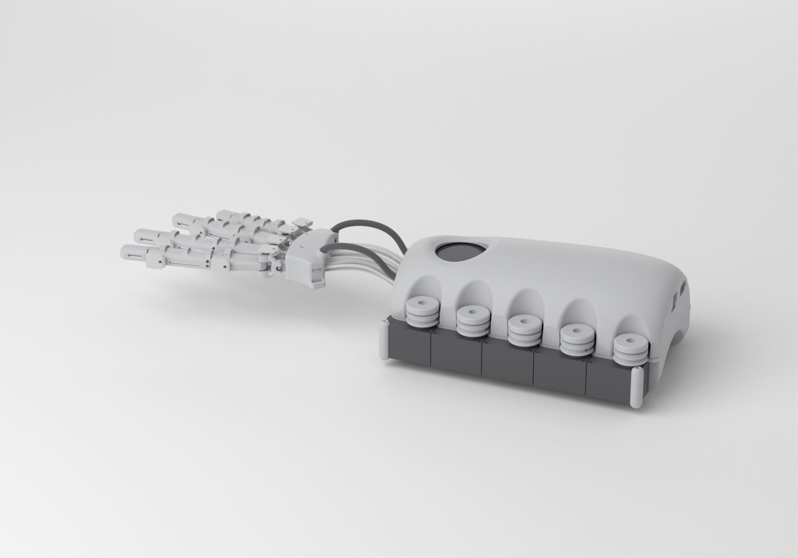

# TAKTO ONE

**A sensor-integrated, tendon-driven hand exoskeleton and open robotics research platform.**

TAKTO ONE combines wearable mechanics, magnetic joint sensing, embedded motor control, custom
electronics, and a live browser digital twin in one coherent system. It was designed, built,
instrumented, and programmed end to end by Sebastian Molano.

This repository is a clean engineering release: the current files needed to inspect, reproduce,
and extend the platform — mechanical CAD, PCB sources, firmware, and software — without the
private thesis, historical iterations, personal scan geometry, or unrelated experiments.

---

## At a glance

| | |
| --- | --- |
| **Mechanism** | Tendon-driven, four instrumented long-finger assemblies |
| **Joint sensing** | 12 AS5600 magnetic encoders, 3 per long finger, read live together |
| **Controller** | Teensy 4.1 |
| **Motor bus** | Dynamixel Protocol 2.0 over a 74HC241 half-duplex interface — the microcontroller owns the bus; a host PC is optional |
| **Electronics** | 2 custom PCBs (encoder board, palm carrier) with full KiCad sources and manufacturing outputs |
| **Interface** | Browser operator console with a live 3D hand twin, fed by a serial-to-WebSocket bridge |
| **Structure** | 3D printed; the as-built prototype uses both PETG and PLA |

## Repository layout

| Area | Contents |
| --- | --- |
| [`cad/`](cad/) | Mechanical parts as print-ready STL and neutral STEP, exported from Fusion |
| [`electronics/`](electronics/) | KiCad sources and manufacturing outputs for both boards |
| [`firmware/`](firmware/) | Unified Teensy 4.1 firmware: sensing, display, recording, Dynamixel support |
| [`software/`](software/) | Operator console, live 3D twin, and the serial-to-WebSocket bridge |
| [`docs/`](docs/) | Media and the [release verification record](docs/RELEASE_VERIFICATION.md) |

## Start here

1. Review [`cad/README.md`](cad/README.md) and choose the STEP or STL files you need.
2. Review [`electronics/README.md`](electronics/README.md) before ordering boards or wiring the motor bus.
3. Build the Teensy sketch following [`firmware/README.md`](firmware/README.md).
4. Run the digital twin in mock mode, then connect it to hardware — see [`software/README.md`](software/README.md).

The embedded Dynamixel implementation is also maintained as the standalone
[`dynamixel-on-device`](https://github.com/molanocortes/dynamixel-on-device) project.

## Validation status

Being explicit about what has and has not been demonstrated matters more than a longer feature
list. What is verified:

- Four long-finger assemblies are physically built and instrumented.
- All 12 magnetic joint encoders have been read live together and visualized in the web twin.
- The Teensy 4.1 can own the Dynamixel bus through the 74HC241 half-duplex interface.
- Both PCB designs exist as manufactured designs with complete sources and outputs.
- The included firmware compiles for a Teensy 4.1, and the bridge serves a live console
  session in simulation. See the [release verification record](docs/RELEASE_VERIFICATION.md).

What is **not** established by this repository:

- The firmware supports additional sensors and motor-control modes, but a code path is not a
  validated worn behavior. Verify the installed IMUs, thumb configuration, actuator count,
  limits, and safety behavior on your exact hardware.
- Force rendering, transparency control, and assistance behavior are not characterized here.
- Simulation exercises the software pipeline, not the device. Serial communication with
  physical hardware was not retested during repository preparation.
- Timing figures must be read carefully: internal loop rate, telemetry rate, console update
  rate, and end-to-end latency are different quantities and are not interchangeable.

## Safety

TAKTO ONE is an experimental research prototype. **It is not a medical device and not a
certified protective product.** Do not use it for diagnosis, treatment, unsupervised
rehabilitation, or safety-critical operation.

Keep actuator power independently removable, begin with torque disabled, test away from the
body, confirm mechanical limits, and validate watchdog and fault behavior before any worn
experiment.

## Deliberately not included

The submitted master's thesis, personal arm-scan geometry, historical CAD and firmware
branches, vendor CAD models, supplier account and order history, AR and Android prototypes not
ready for a polished release, and private documents.

## License

**The licensing structure is still under review.** The software, electronics, CAD,
documentation, and media may require different terms.

Until explicit licenses are added, the TAKTO-authored files in this repository are publicly
viewable, but no permission is granted to copy, modify, redistribute, manufacture,
commercialize, or use them for machine-learning or AI training. See [`LICENSE.md`](LICENSE.md)
and [`THIRD_PARTY_NOTICES.md`](THIRD_PARTY_NOTICES.md).

If you want to build on this work, please open an issue — resolving the license is an active
priority and knowing what people need will inform it.

Copyright © 2026 Sebastian Molano.
