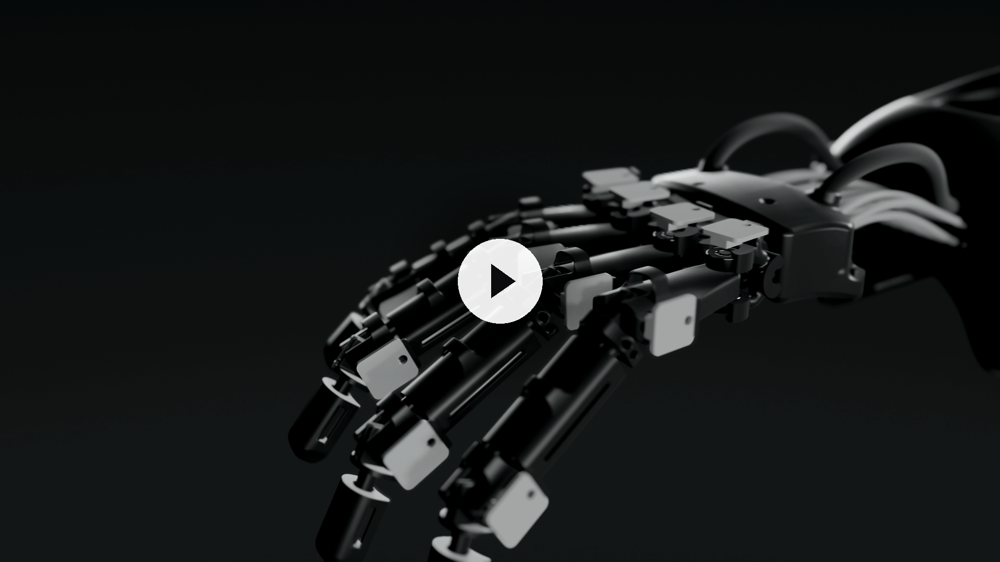

<div align="center">


# TAKTO ONE

### A sensor-integrated, tendon-driven hand exoskeleton — open from the CAD up.

Twelve magnetic joint encoders · Embedded Dynamixel control, no host PC in the loop · A live browser digital twin

[](LICENSE.md)
[](LICENSE.md)
[](LICENSE.md)
[](firmware/)
[](CONTRIBUTING.md)

</div>

---

<div align="center">

### See it move

https://github.com/molanocortes/takto-one/raw/main/docs/media/takto-one-film.mp4

<a href="https://github.com/molanocortes/takto-one/raw/main/docs/media/takto-one-film.mp4"></a>

<sub><a href="https://github.com/molanocortes/takto-one/raw/main/docs/media/takto-one-film.mp4"><b>▶ Watch the film</b></a> · 30 seconds · 1280×720</sub>

</div>

---

## What it is

A wearable robotic hand platform built end to end as a master's thesis — mechanics, industrial
design, custom PCBs, embedded firmware, motor control, and a live web interface. It is published
so other people can study it, build it, and take it further.

| | |
| --- | --- |
| **Mechanism** | Tendon-driven, four instrumented long-finger assemblies |
| **Actuation** | Series-elastic, through elastic tendons and ratchet-based spools |
| **Joint sensing** | 12 × AS5600 magnetic encoders, 3 per finger, read live together |
| **Controller** | Teensy 4.1 |
| **Motor bus** | Dynamixel Protocol 2.0 over a 74HC241 half-duplex interface — **the microcontroller owns the bus; no host PC required** |
| **Electronics** | 2 custom PCBs, full KiCad sources + manufacturing outputs |
| **Interface** | Browser operator console with a live 3D twin, over a serial→WebSocket bridge |
| **Structure** | 3D printed; as built, a mix of PETG and PLA |

---

<div align="center">


</div>

---

## Every angle

<table>
<tr>
<td width="50%"></td>
<td width="50%"></td>
</tr>
<tr>
<td align="center"><sub><b>Plan</b> — ten tendon spools, twelve instrumented joints</sub></td>
<td align="center"><sub><b>Profile</b> — actuator bank and forearm shell</sub></td>
</tr>
</table>

## Inside it

Two custom boards, designed from scratch. Full KiCad sources and manufacturing outputs are in
[`electronics/`](electronics/) — these renders come straight from those files.

<table>
<tr>
<td width="42%"></td>
<td width="58%"></td>
</tr>
<tr>
<td align="center"><sub><b>Encoder board</b> — AS5600 magnetic angle sensor, one per joint</sub></td>
<td align="center"><sub><b>Palm carrier</b> — shaped to the hand, multiplexes the encoder fan-out</sub></td>
</tr>
</table>

## How it fits together

Sensing → aggregation → control → interface:


And the full point-to-point wiring — every pin terminated, both I²C multiplexers, all fourteen
encoder channels, three IMUs, and the 74HC241 servo bus. The
[PDF](docs/global-wiring.pdf) is the printable version.

<a href="docs/global-wiring.pdf"></a>

---

## Start here

**Read [`docs/README.md`](docs/README.md) first** — system architecture, the illustrated build
guide, and the known corrections between the documentation and the current hardware.

```bash
git clone https://github.com/molanocortes/takto-one.git
cd takto-one

# see the console and 3D twin immediately, no hardware needed
python3 -m http.server 8096 --directory software/console/app
# open http://localhost:8096/
```

| Step | Where |
| --- | --- |
| Choose and print parts | [`cad/README.md`](cad/README.md) |
| Order and wire the boards | [`electronics/README.md`](electronics/README.md) |
| Flash the Teensy | [`firmware/README.md`](firmware/README.md) |
| Connect the twin to hardware | [`software/README.md`](software/README.md) |

The embedded Dynamixel driver is also maintained standalone as
[**dynamixel-on-device**](https://github.com/molanocortes/dynamixel-on-device).

---

## What is verified, and what is not

Being precise about this matters more than a longer feature list.

**Verified on hardware.** The firmware runs on the device. The Teensy owns the Dynamixel bus
through the 74HC241 and drives the fingers. All twelve magnetic encoders read live together and
feed the browser digital twin in real time. Four long-finger assemblies are physically built and
instrumented, and both PCBs exist as manufactured designs with complete sources.

**Not established by this repository.** Force rendering, transparency control, and assistance
behavior are not characterized here. Timing figures need care: internal loop rate, telemetry
rate, console update rate, and end-to-end latency are different quantities and are not
interchangeable. Verify the installed IMUs, thumb configuration, actuator count, limits, and
safety behavior on your own hardware before any worn experiment. Repository-preparation checks
are recorded in the [verification record](docs/RELEASE_VERIFICATION.md).

**Known limitations, stated plainly.** Ten motors makes this an expensive build. The
series-elastic actuation is a simple implementation — elastic tendons and ratchet spools — not
an advanced SEA design. Recent soft-robotics work achieves comparable joint and force sensing
with simpler mechanisms. This is a working, well-instrumented research platform, not a claim to
the state of the art. Those gaps are exactly where contributions would help most.

## Safety

> TAKTO ONE is an experimental research prototype. **It is not a medical device and not a
> certified protective product.** Do not use it for diagnosis, treatment, unsupervised
> rehabilitation, or safety-critical operation.

Keep actuator power independently removable, begin with torque disabled, test away from the
body, confirm mechanical limits, and validate watchdog and fault behavior before any worn
experiment.

---

## Contributing

**This project is actively developed and contributions are genuinely wanted.** It is a research
platform, not a finished product, and the limitations above are open invitations.

Good places to start:

- **Build one** — and tell us what was unclear, what did not fit, what you changed. Build
  reports are the single most valuable contribution.
- **Improve the actuation** — a better series-elastic design is the most interesting open problem here.
- **Reduce the motor count** — ten is expensive; underactuation would widen who can build this.
- **Fix documentation** — known deltas are listed in [`docs/README.md`](docs/README.md); find more.
- **Firmware, bridge, console** — bugs, features, and platform ports.

See [`CONTRIBUTING.md`](CONTRIBUTING.md). Open an issue with questions, ideas, or photos of your
build — showing what you made is always welcome.

## License

Software **Apache-2.0** · Hardware **CERN-OHL-S-2.0** · Documentation and media **CC-BY-4.0**.
Full detail, attribution format, and the text-and-data-mining reservation: [`LICENSE.md`](LICENSE.md).

<div align="center">
<sub>Designed and built by Sebastian Molano · Hochschule Anhalt · Made in Germany</sub>
</div>
