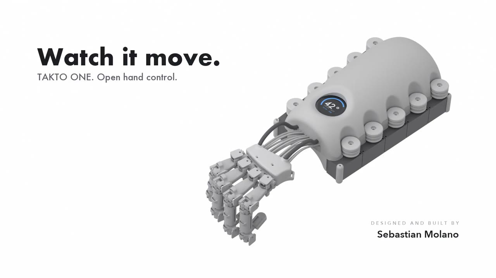
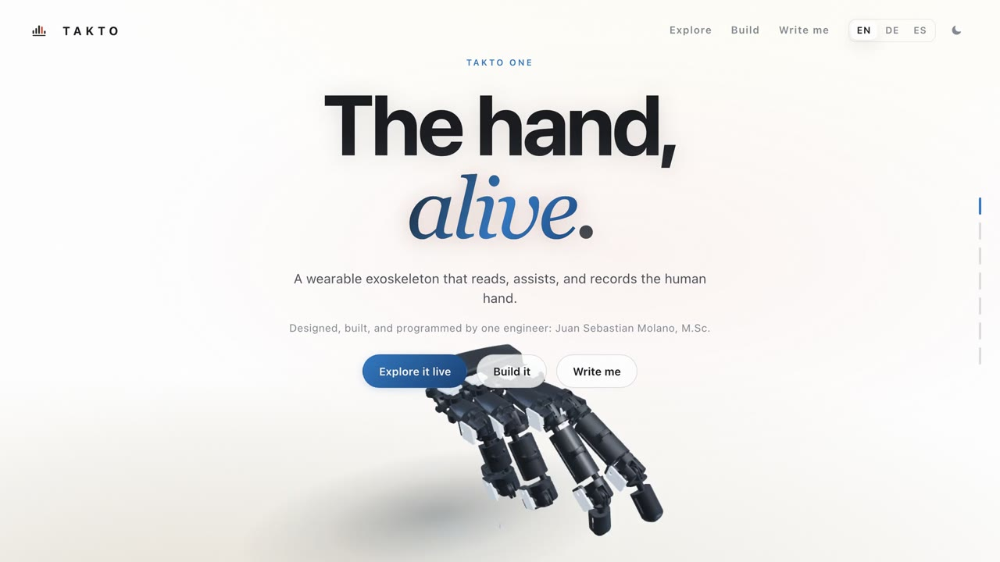
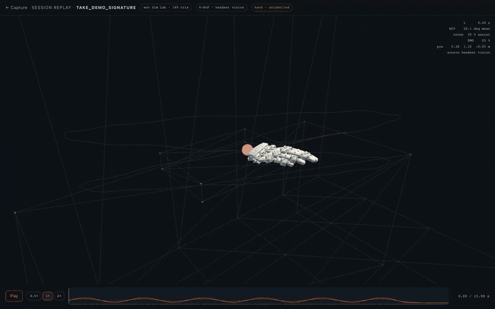
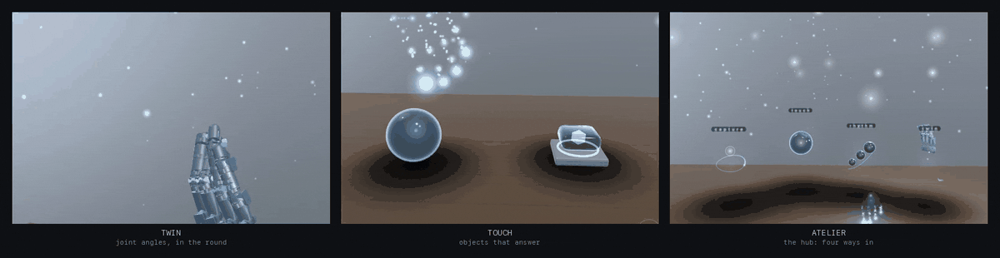
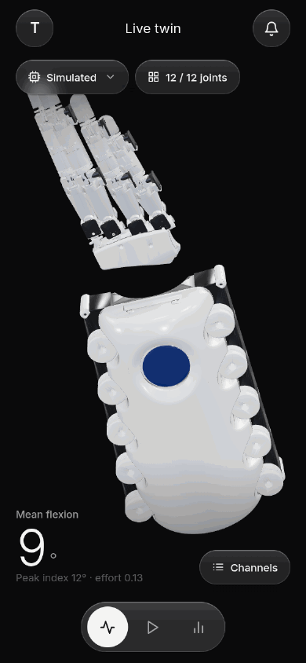
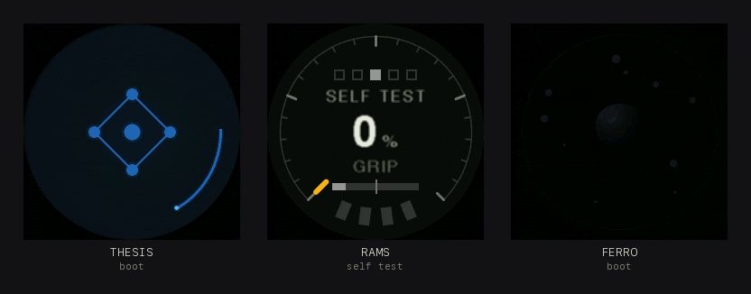
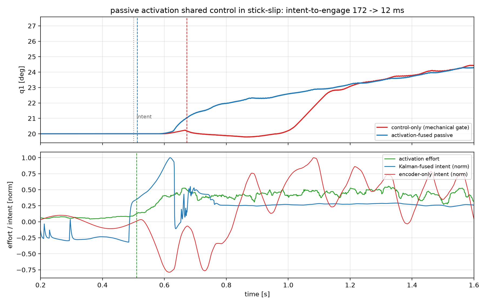
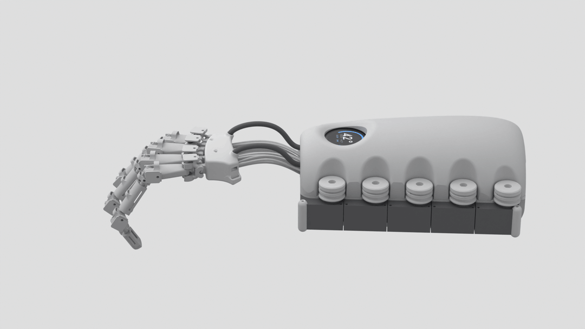
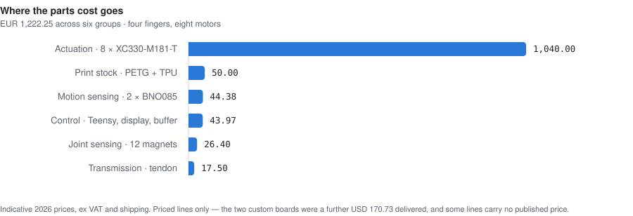

<div align="center">


# TAKTO ONE

### Open hand control. Read every finger. Drive every finger.

TAKTO ONE is an open-source hand exoskeleton: it reads twelve finger joints at the joint
itself and pulls them back through tendons, with the control loop on the device, not on a laptop. Wear it and your hand becomes an
instrument: every motion measured, recorded, and answered with force. This repository is
every file needed to build one.

[](LICENSE.md)
[](LICENSE.md)
[](LICENSE.md)
[](firmware/)
[](CONTRIBUTING.md)

</div>

---

<!-- The film. A poster image linking to the in-repo .mp4, which opens GitHub's own
     video player on the blob page. This form cannot break: the link is repo-relative, so
     it survives forks and needs nothing minted.

     History, so nobody re-breaks it. There are two ways to show a film here and they do
     NOT combine. A bare user-attachments URL alone on its own line becomes an inline
     autoplaying-on-click player, but only that URL form works and only a browser drag can
     mint one (no API, gh included). Wrapping that URL in a <video> tag defeats it: GitHub's
     sanitiser strips <video>, leaving only the <a> fallback inside. That is exactly
     what happened here, and when both attachment URLs later went dead the surviving posters
     became clickable 404s on a public repository.

     To restore the inline player: encode a sub-10MB copy of docs/media/TAKTO-ONE.mp4, drag
     it into any issue comment to mint a URL, and put that URL alone on its own line,
     OUTSIDE any raw HTML block, with no <video> tag and no markdown brackets. Verify it
     unauthenticated before relying on it. Until then the poster below is the safe form. -->


<div align="center">
  <a href="docs/media/TAKTO-ONE.mp4"></a>
</div>

---

<div align="center">


</div>


---

## Why a hand, and why this one

Your hand is the highest-bandwidth interface you own, and machines still read it badly. A
camera loses fingers the moment they cross, curl, or leave frame. A glove full of flex sensors
drifts. TAKTO ONE puts a magnetic encoder on the joint itself, three per finger, twelve in
all, so the measurement ignores occlusion, lighting, and where you happen to stand. And
because the microcontroller owns the motor bus, the device acts without a computer in the loop.

Per-joint truth going in, tendon force coming out, no host required. It is a hand-shaped input
and output device, and what you point it at is up to you.

## What it already does

Two of the most useful things a hand platform can do are built and in this repository.

**Motion capture that writes to the device, not to a browser.** The firmware logs to the
Teensy's own SD card, one row per frame: all fourteen encoder channels, the hand, forearm and
thumb quaternions, EMG envelope and RMS, the crown, and full motor telemetry. One sensor
acquisition feeds the SD row, the serial stream and the display, so the log and the live view
can never disagree. The rate is a firmware constant, not a display refresh. The result is
serious hand-motion data: per-joint, occlusion-free, timestamped, labelled by physics instead
of by another model's guess.

**Teleoperation and assistance.** The control law runs on the Teensy in three modes: idle,
direct current, and a blend that moves continuously between *transparent*, where the device
follows the wearer and stays out of the way, and *assist*, where it drives toward a setpoint.
The blend is a live parameter, so the hand can lead the device, the device can lead the hand,
or anything in between. Setpoints, gains and current limits are all exposed over the serial
protocol, which is what lets one hand drive another.

Together they close the loop that matters: read a hand precisely, record it, and play it back
into a hand.

---

## The browser surfaces

There are four of them and they all read the same stream: the front end and the console
here, then the AR layer and the phone companion further down. None of them needs hardware.
Run the bridge with `--sim` and they animate on synthetic joints instead. What reaches the
browser is 60 Hz, which is a display rate and says nothing about how fast the device itself
runs (see [On rates](#a-note-on-rates)). Every twin renders the same articulated geometry
that ships in [`cad/`](cad/).

<!-- Poster linking to the in-repo .mp4, for the reasons given at the film above. The
     <video>-tag approach that used to be here was stripped by GitHub's sanitiser and its
     attachment URL went dead, leaving a poster that clicked through to a 404. This form
     renders the same on desktop and in the mobile app. -->

<div align="center">
  <a href="docs/media/TAKTO-SURFACES.mp4"></a>
</div>

<div align="center">

<sub><b>The public front end.</b> A single scrolling page. The device turns and the fingers
move as you scroll, so each claim ends up beside the part of the machine it describes.<br>
<b>The operator console.</b> Live 3D twin, twelve per-joint encoders, motor state, EMG
effort, current draw, the device's own round screen, and calibration. Shown here on the
simulator, which is why the link says <i>mock</i>.</sub>

</div>


---

## Session replay: motion, played back in space

Record a hand once and it replays anywhere the twin runs. The viewer rebuilds the session as a
4D scene: the real device GLB articulated by the twelve recorded joint angles, the wrist flying
the 6-DoF path the headset measured, the room drawn from the environment mesh stored with the
take, and the flexion and effort traces under the scrubber. Any speed, any angle, forever.

<div align="center">



<sub><b>take_demo_signature</b>, played at 2× in the shipped viewer. One of three sample takes
in [`software/bridge/samples/`](software/bridge/samples/) — choreographed, synthetic, and
generated by a script that ships beside them. Three commands and this plays on your machine
with no hardware.</sub>

</div>

The format is the same one the device writes to its SD card, so your own recordings drop
straight in. The environment store is wired end to end, but dense room reconstruction from the
Quest 3S is still open work: the viewer, the store and the upload path are all waiting for it,
and putting a real scanned room behind these trajectories is one of the most satisfying
contributions this project has to offer. See [Contributing](#contributing).


---

## LUMEN: the AR layer

**Source included:** [`software/ar/`](software/ar/)

A spatial layer that puts the hand twin and its data into the room instead of on a monitor.
It reads the same WebSocket stream as the console, needs no separate backend, and runs in a
plain browser on the desktop, which is how the frames below were captured.

<div align="center">



<sub>Running live in the desktop preview: <b>twin</b>, the articulated hand driven by joint
angles and seen from a moving viewpoint &nbsp;·&nbsp; <b>touch</b>, objects that answer the wearer's fingers &nbsp;·&nbsp;
<b>atelier</b>, the hub, where the four modes are objects you reach toward rather than buttons.
Butterflies drift through every one of them.</sub>

</div>

Five modes ship: `atelier` as the hub, plus `twin`, `touch`, `rhythm` and `capture`. The scene
carries the device's own geometry, so what you reach toward is the machine on your arm. It is
also inhabited: butterflies wander the room, settle on the desk edge to rest their wings, and
lift off again, and rare comets cross the upper air. None of it competes with the work; it just
means the space is alive while you are in it.

> **Prototype, captured on the desktop preview** rather than in a headset. Known high-DPI bug:
> the render target is sized from CSS pixels while the canvas backs at the device ratio, so on
> a 2x display the scene draws into a quarter of the canvas. Force a device pixel ratio of 1 as
> a workaround; fixing it properly is a good first contribution.


---

## The phone companion

**Source included:** [`software/app/`](software/app/)

A pocket instrument for the times the laptop is not the right one: watch the twin, replay a
recorded session, and read the twelve joints and the activation channel, from the same stream
and protocol as everything else here. One Expo codebase for iOS, Android and the browser.

<div align="center">



<sub><b>Overview</b>, the device at a glance &nbsp;·&nbsp; <b>Analytics</b>, the twelve joints and
the activation channel &nbsp;·&nbsp; <b>Logs</b>, the source, the bundled sessions and the rates</sub>

<sub>The travelling wave, index to pinky, on the synthetic feed. Twelve joints driven
independently, and all three surfaces pinned to the same clock: one instant of the app, not
three screens shot at three different moments.</sub>

</div>

The twin is the real CAD driven by the shared mechanical model in
[`kinematics.js`](software/app/src/data/kinematics.js): the angles, the telescopic slides those
angles demand, and the spool rotations that produce them. It runs with no hardware at all on
the same synthetic feed as every other surface, and the three bundled sessions are the
repository's own sample takes. Point it at a bridge and it reads a real device.

An earlier Android-only build is superseded by this one; its emulator captures are gone from
this page.


---

## The device screen

The Teensy drives a round display, and the face engine that paints it is part of the firmware.
Three faces ship, each covering every device state: battery, boot, calibrate, fault, idle,
linked, recording, saved, standalone, stop and teleop.

**None of these are static screens.** Every face animates: boot sweeps and self-tests, the
teleop ring tracking assist, the recording counter and its take meter, idle breathing while
nothing is happening. The engine runs a dirty-tile renderer inside a fixed frame budget, so the
paint never starves the control tick.

<div align="center">



<sub>Live faces, rendered by the firmware's own rasterizer from a mock feed and played at the
speed they were authored: the three boot sequences, then <b>recording</b> counting a take up in
two design languages, and <b>idle</b> breathing.</sub>

</div>

<div align="center">


<sub>Every face against every state. These are renders, not photographs of the physical screen.</sub>

</div>

The **thesis** face is the one used throughout the thesis work. Source, the face engine, the
frame budget and the flashing runbook are in
[`firmware/takto_one/watch/`](firmware/takto_one/watch/).

---

## EMG in the loop

Most hand devices sense position. TAKTO ONE also listens to the muscles.

The front end is a **MyoWare 2.0 muscle sensor** on a standard **three-lead setup**: two
electrodes along the target muscle belly and one reference on electrically quiet tissue, a
nearby bone or joint. The board does the analogue work — differential amplification of the two
muscle leads against the reference, rectification and envelope detection — and hands the
firmware a clean envelope on pin 14. The device carries the Ag/AgCl snap interface for it, so
it takes the same disposable gel electrodes used for ECG and EMG in clinical and lab work: skin
contact costs cents, not a custom part, and anyone can replace a pad mid-session.

The firmware oversamples that envelope at roughly 1 kHz between 50 Hz frames, reduces it to a
mean envelope plus RMS, and writes both into every frame of the stream and every row of the SD
log — on the same clock as the twelve encoders and the IMUs.

That single time base is the point. Encoders say what the hand did, IMUs say how it moved
through space, and EMG says what the wearer intended, fractions of a second before the joints
follow. Three signals, one clock: training data for models that learn intent, and a third
input for whoever builds the next control layer. The operator console and the public front end
both draw the live effort channel.

<div align="center">



<sub>From the project's intent-fusion research: in a stick-slip scenario the encoder-only
observer takes 172 ms to engage assist; fusing the activation channel cuts that to 12 ms,
inside an energy-budgeted control law that provably cannot drive motion on its own.</sub>

</div>

Behind that figure sits a research track in the wider project, not in this release: a causal
acquisition pipeline (band-pass, notch, RMS envelope), a whitened Bayesian decoder, and an
energy-tank shared-control law where activation leads the encoder during isometric loading
while a passivity certificate guarantees it can never self-drive the joint. Developed and
validated against a documented synthetic signal model with reproducible pass reports, and
stated as exactly that: signal-processing and control research, ready for hardware trials, not
claims about human experiments. If multi-source intent detection is your field, this device
was built to be your testbed.

---

## Sign language: a worked example

The clearest proof that this is a platform is **TAKTO-SIGN**: a German Sign Language capture,
training and live-recognition stack built on exactly this hardware. It records finger bend and
hand orientation at 60 Hz, learns a designed vocabulary, and recognises signs live. Like
everything else here, it runs end to end with no hardware through `--sim`.

Its scope statement is worth repeating because it is the right way to talk about work like
this: a **signer-dependent isolated-sign recogniser** with a continuous scripted-sentence path
and a measured cross-signer result. It is not open-vocabulary translation.

One application, built by one person, on this platform. An example of what the hardware
supports, not the limit of it.

## Where it can go from here

Read every finger and drive every finger, and a whole class of problems opens up. These are
**directions, not delivered features**; each is a project of its own, and open-sourcing the
platform is how they happen in parallel instead of one at a time. Every one of them starts
from the files already in this repository.

| | |
| --- | --- |
| **Drive a robot hand** | Per-joint angles map onto a robot hand with no camera rig and no capture volume. The exciting version is reach: a manipulator underwater, in a hot cell, or on another continent, driven by a hand that stays somewhere safe. |
| **Train models on better data** | The capture above already produces clean per-joint ground truth. What is missing is scale: many hands, many tasks, a shared schema, a published dataset. That is community work. |
| **Sign language** | Already begun. See [Sign language](#sign-language-a-worked-example). |
| **Force feedback, per finger** | A tendon and a motor behind each finger means resistance that varies as you move: a surface that stops you, the give of soft tissue, the weight of a load, felt finger by finger instead of as one buzz through a handle. The control modes ship; the haptic rendering does not. |
| **Rehabilitation and assessment** | Range of motion measured objectively across sessions, and assisted movement for a hand that cannot finish the motion alone. |
| **Precision machine control** | Wherever a joystick is too blunt and a touchscreen impossible: gloved, wet, in the dark, eyes needed elsewhere. |

Current status is stated plainly in [Where the project really stands](#where-the-project-really-stands).

---

## The machine



| | |
| --- | --- |
| **Mechanism** | Tendon-driven, four instrumented long-finger assemblies |
| **Actuation** | Series-elastic, through elastic tendons and ratchet-based spools |
| **Joint sensing** | 12 × AS5600 magnetic encoders, 3 per finger, read live together |
| **EMG** | Embedded Ag/AgCl electrode interface for standard snap gel electrodes; envelope + RMS in every frame |
| **Controller** | Teensy 4.1 |
| **Motor bus** | Dynamixel Protocol 2.0 over a 74HC241 half-duplex interface, **the microcontroller owns the bus; no host PC required** |
| **Electronics** | 2 custom PCBs, full KiCad sources + manufacturing outputs |
| **Interface** | Browser operator console with a live 3D twin, over a serial→WebSocket bridge |
| **Structure** | 3D printed; as built, a mix of PETG and PLA |
| **Parts** | 71 printed parts, 8 servos, 12 encoder boards. Full [bill of materials](docs/BOM.md) |


---

## Inside it

Two custom boards, designed from scratch. Full KiCad sources and manufacturing outputs are in
[`electronics/`](electronics/); these renders come straight from those files.

<table>
<tr>
<td width="42%"></td>
<td width="58%"></td>
</tr>
<tr>
<td align="center"><sub><b>Encoder board</b>, AS5600 magnetic angle sensor, one per joint</sub></td>
<td align="center"><sub><b>Palm carrier</b>, shaped to the hand, multiplexes the encoder fan-out</sub></td>
</tr>
</table>

---

## How it fits together

Sensing → aggregation → control → interface:


And the full point-to-point wiring: every pin terminated, both I²C multiplexers, all fourteen
encoder channels, all three IMU positions, and the 74HC241 servo bus. The
[PDF](docs/global-wiring.pdf) is the printable version.

<a href="docs/global-wiring.pdf"></a>


---

## What it costs to build

Eight motors, twelve instrumented joints, seventy-one printed parts. The servos are nearly the
whole bill; every other group put together is under a fifth of it, which is why cutting the
motor count is the most useful thing anyone could contribute.

<div align="center">
  <picture>
    <source media="(prefers-color-scheme: dark)" srcset="docs/media/bom-cost-dark.svg">
    
  </picture>
</div>

Part numbers, suppliers, quantities and the caveats are in **[`docs/BOM.md`](docs/BOM.md)**,
with a machine-readable copy in [`docs/bom.csv`](docs/bom.csv).


---

## Start here

Clone to a moving hand in under a minute: the console opens in simulation, so you can explore
the whole stack before you print a single part.

```bash
git clone https://github.com/molanocortes/takto-one.git
cd takto-one

# see the console and 3D twin immediately, no hardware needed
python3 -m http.server 8096 --directory software/console/app
# open http://localhost:8096/
```

Then read [`docs/README.md`](docs/README.md): system architecture, the illustrated build
guide, and the known corrections between the documentation and the current hardware.

| Step | Where |
| --- | --- |
| Source the parts | [`docs/BOM.md`](docs/BOM.md) |
| Choose and print parts | [`cad/README.md`](cad/README.md) |
| Order and wire the boards | [`electronics/README.md`](electronics/README.md) |
| Flash the Teensy | [`firmware/README.md`](firmware/README.md) |
| Connect the twin to hardware | [`software/README.md`](software/README.md) |

The embedded Dynamixel driver is also maintained standalone as
[**dynamixel-on-device**](https://github.com/molanocortes/dynamixel-on-device).


## Where the project really stands

Precision here matters more than a longer feature list.

**Verified on hardware.** The firmware runs on the device. The Teensy owns the Dynamixel bus
through the 74HC241 and drives the fingers: motor-controlled finger movement was demonstrated
and tested on the bench, with the transmission run both with and without its elastic element
in series. All twelve magnetic encoders read live together
and feed the browser twin in real time. Two BNO085 IMUs are fitted, on the hand and the
forearm. Four long-finger assemblies are built and instrumented, and both PCBs exist as
manufactured designs with complete sources.

The firmware and the wiring carry a third IMU channel for a thumb-tip unit that is **not
fitted**, in the same way the two multiplexers carry fourteen encoder channels for twelve
populated encoders. The unfitted channel reports MISSING in the `s` bus scan, streams a live
flag of zero, and logs an identity quaternion, so nothing downstream mistakes it for data.

**Not established by this repository.** Force rendering, transparency control, and assistance
behavior are not characterized by measurements here. Verify the actuator count, limits, and
safety behavior on your own hardware before any worn experiment.
Repository-preparation checks are in the [verification record](docs/RELEASE_VERIFICATION.md).

**Known limitations.** Eight motors makes this an expensive build. The series-elastic
actuation is a simple implementation, elastic tendons and ratchet spools, not an advanced SEA
design. Recent soft-robotics work achieves comparable sensing with simpler mechanisms. This is
a working, well-instrumented research platform, not a claim to the state of the art, and those
gaps are exactly where contributions help most.

### A note on rates

Loop rate, sampling rate, telemetry rate and console update rate are four different numbers;
collapsing them into one is the easiest way to mislead someone.

- **Browser console: 60 Hz.** Snapshot broadcast to connected browsers. A display rate.
- **Firmware streaming default: 50 Hz.** `SAMPLE_HZ` in the shipped sketch, the serial-line rate.
- **Embedded control loop: up to 2 kHz.** The control law runs on the Teensy, next to the actuator.
- **On-device capture is bound by none of the above.** The streaming rate is a firmware
  constant, and logging can run considerably faster than what the console displays.

The ceiling on encoder sampling is set by the I²C bus and multiplexer switching, and it has
not been characterised here. If your application depends on a specific rate, measure it on
your own build.

## Safety

> TAKTO ONE is an experimental research prototype. **It is not a medical device and not a
> certified protective product.** Do not use it for diagnosis, treatment, unsupervised
> rehabilitation, or safety-critical operation.

Keep actuator power independently removable, begin with torque disabled, test away from the
body, confirm mechanical limits, and validate watchdog and fault behavior before any worn
experiment.


## Contributing

This project is under active development and contributions are genuinely wanted. The
limitations above are not fine print; they are the to-do list, and some of the most
interesting problems are still unclaimed.

- **Build one**, and tell us what was unclear, what did not fit, what you changed. Build
  reports are the single most valuable contribution.
- **Improve the actuation.** The current transmission runs on the bench with and without its
  elastic element in series; a better series-elastic design is the most interesting open
  problem here.
- **Reduce the motor count.** Eight is expensive; underactuation would widen who can build this.
- **Build the thumb.** The forearm carries ten spool bays and only eight are used, so the room
  for a thumb pair is already in the mechanism, and the firmware already addresses two spare
  encoder channels. A thumb's linkage, tendon routing and kinematics are yours to invent;
  the fingers' already exist and work.
- **Scan the room.** The replay viewer, the environment store and the upload path are wired
  end to end; dense room reconstruction from the Quest 3S is the missing piece. Make a real
  room appear behind the trajectories and session replay becomes a spatial lab notebook.
- **Fix documentation.** Known deltas are listed in [`docs/README.md`](docs/README.md); find more.
- **Firmware, bridge, console.** Bugs, features, and platform ports.

See [`CONTRIBUTING.md`](CONTRIBUTING.md). Open an issue with questions, ideas, or photos of
your build; showing what you made is always welcome. For anything that does not belong in a
public issue, write to [sebastian.molano.29@gmail.com](mailto:sebastian.molano.29@gmail.com).

## License

Software **Apache-2.0** · Hardware **CERN-OHL-S-2.0** · Documentation and media **CC-BY-4.0**.
Full detail, attribution format, and the text-and-data-mining reservation: [`LICENSE.md`](LICENSE.md).

The hardware licence is strongly reciprocal: distribute a modified design and you publish your
modifications. If that does not suit your situation, licensing on other terms is available,
see [`LICENSE.md`](LICENSE.md). Contributors are asked to agree to a short [CLA](CLA.md), which
keeps relicensing possible and leaves your copyright with you.

**TAKTO and TAKTO ONE are trademarks of Sebastian Molano**, asserted as unregistered marks and
not covered by any licence above. Build it, change it, sell it, and say it is based on TAKTO
ONE; just give your own version its own name. Details in [`LICENSE.md`](LICENSE.md).

<div align="center">
<sub>Designed and built by Sebastian Molano · Hochschule Anhalt · Made in Germany<br>
<a href="mailto:sebastian.molano.29@gmail.com">sebastian.molano.29@gmail.com</a></sub>
</div>
