<div align="center">

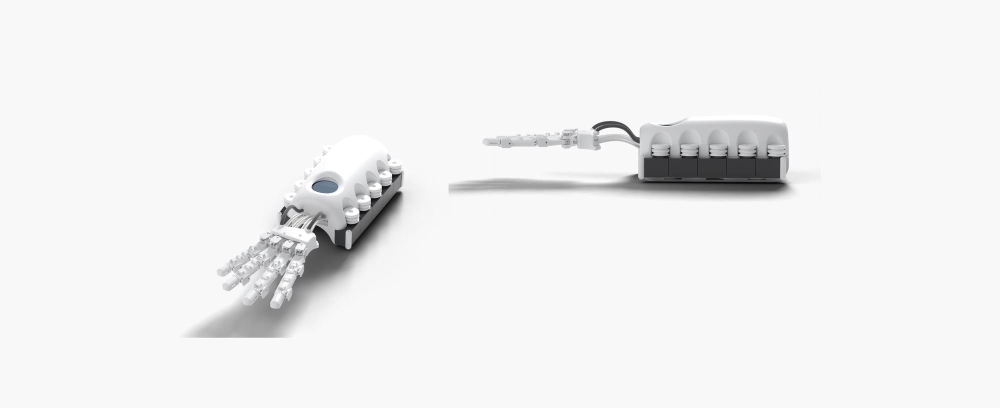

# TAKTO ONE

### Open hand control. Read every finger. Drive every finger.

TAKTO ONE measures the angle of **twelve finger joints** and can pull them back through tendons.
The control loop runs on the device itself, so neither the sensing nor the actuation is waiting
on a computer. It is a wearable platform for reading the human hand precisely, and for putting
force back into it, with every file needed to build one.

[](LICENSE.md)
[](LICENSE.md)
[](LICENSE.md)
[](firmware/)
[](CONTRIBUTING.md)

</div>

---

<!-- The film. This bare URL is what GitHub turns into a video player, so it must stay
     alone on its own line and OUTSIDE any raw HTML block: the conversion does not fire
     inside a <div>. Do not wrap it in a <video> tag or in markdown link brackets, and do
     not swap it for a repo-relative path - GitHub's sanitiser strips <video> outright, and
     raw.githubusercontent serves .mp4 as application/octet-stream, so neither will play.
     docs/media/TAKTO-ONE.mp4 is the durable in-repo copy. It is the same film without
     the one-second cover card, which exists only so the player has a thumbnail; it is not
     re-committed on each cover change, to keep binary churn out of git history. -->

https://github.com/user-attachments/assets/1538657f-96ee-4b98-8d4a-2e254e1aeca6

---

<div align="center">

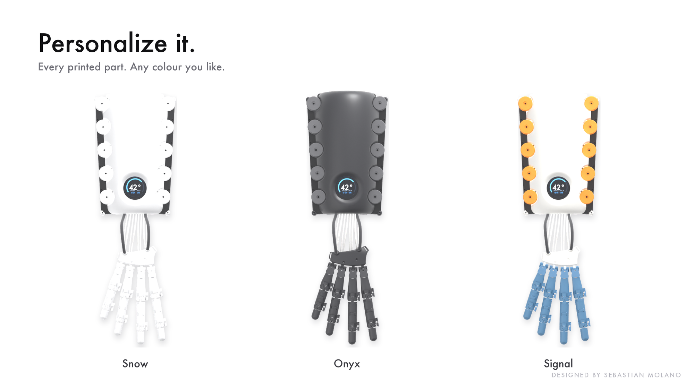

</div>

---

## Why a hand, and why this one

A camera watching your hand loses fingers the moment they cross, curl, or leave frame. A glove
full of flex sensors drifts. TAKTO ONE puts a **magnetic encoder on the joint itself**, three
per finger, twelve in all, so the measurement does not care about occlusion, lighting, or where
you are standing. The microcontroller owns the motor bus, so the device does not need a computer
in the loop to act.

That combination, **per-joint truth going in, tendon force coming out, no host required**, is
what makes it a platform rather than a gadget. It is a hand-shaped input and output device, and
what you point it at is up to you.

## What it already does

Two of the things this platform is most useful for are **built, and in this repository.**

**Motion capture that writes to the device, not to a browser.** The firmware records to the
Teensy's built-in SD card: one row per frame, carrying all fourteen encoder channels, the hand,
forearm and thumb quaternions, EMG envelope and RMS, the crown, and full motor telemetry
(position, velocity, current, mode and fault flags). A single sensor acquisition feeds the SD
row, the serial stream and the display, so the log and the live view can never disagree. Because
it writes on the device, capture is not limited by a browser or a host connection, and the rate
is a firmware constant rather than a display refresh. That is what makes it a serious source of
hand-motion data: **per-joint, occlusion-free, timestamped, and labelled by physics rather than
by a model's guess.**

**Teleoperation and assistance.** The control law runs on the Teensy in three modes: idle, direct
current, and a blended mode that moves continuously between *transparent*, where the device
follows the wearer and stays out of the way, and *assist*, where it drives toward a position
setpoint. The blend is a live parameter, so the hand can lead the device, the device can lead the
hand, or anything in between. Setpoints, gains and current limits are all exposed over the serial
protocol, which is what lets one hand drive another.

Together those are the loop that matters: **read a hand precisely, record it, and play it back
into a hand.**

## Where it can go from here

That foundation is what puts the following within reach. These are **directions rather than
delivered features.** Each is a project in its own right, and open sourcing the platform is how
they get to happen in parallel instead of one at a time.

| | |
| --- | --- |
| **Drive a robot hand** | Per-joint angles map onto a robot hand without a camera rig or a capture volume. The interesting version is reach: a manipulator underwater, in a hot cell, or on another continent, driven by a hand that stays somewhere safe. |
| **Train models on better data** | The capture described above already produces clean per-joint ground truth. What is missing is scale: many hands, many tasks, a shared schema, a published dataset. That is community work rather than solo work. |
| **Sign language** | Already begun rather than hypothetical. See [Sign language](#sign-language-a-worked-example). |
| **Force feedback, per finger** | A tendon and a motor behind each finger means resistance can be varied as the hand moves: a surface that stops you, the give of soft tissue, the weight of a load. Felt finger by finger, rather than as one vibration through a handle. The control modes ship; the haptic rendering does not. |
| **Rehabilitation and assessment** | Range of motion measured objectively across sessions instead of estimated by eye, and assisted movement for a hand that cannot finish the motion alone. |
| **Precision machine control** | Situations where a joystick is too blunt and a touchscreen is impossible: gloved, wet, in the dark, or with your eyes needed elsewhere. |

Current status is stated plainly in [Where the project really stands](#where-the-project-really-stands).

## The machine

| | |
| --- | --- |
| **Mechanism** | Tendon-driven, four instrumented long-finger assemblies |
| **Actuation** | Series-elastic, through elastic tendons and ratchet-based spools |
| **Joint sensing** | 12 × AS5600 magnetic encoders, 3 per finger, read live together |
| **Controller** | Teensy 4.1 |
| **Motor bus** | Dynamixel Protocol 2.0 over a 74HC241 half-duplex interface, **the microcontroller owns the bus; no host PC required** |
| **Electronics** | 2 custom PCBs, full KiCad sources + manufacturing outputs |
| **Interface** | Browser operator console with a live 3D twin, over a serial→WebSocket bridge |
| **Structure** | 3D printed; as built, a mix of PETG and PLA |

---

## Every angle

<table>
<tr>
<td width="50%">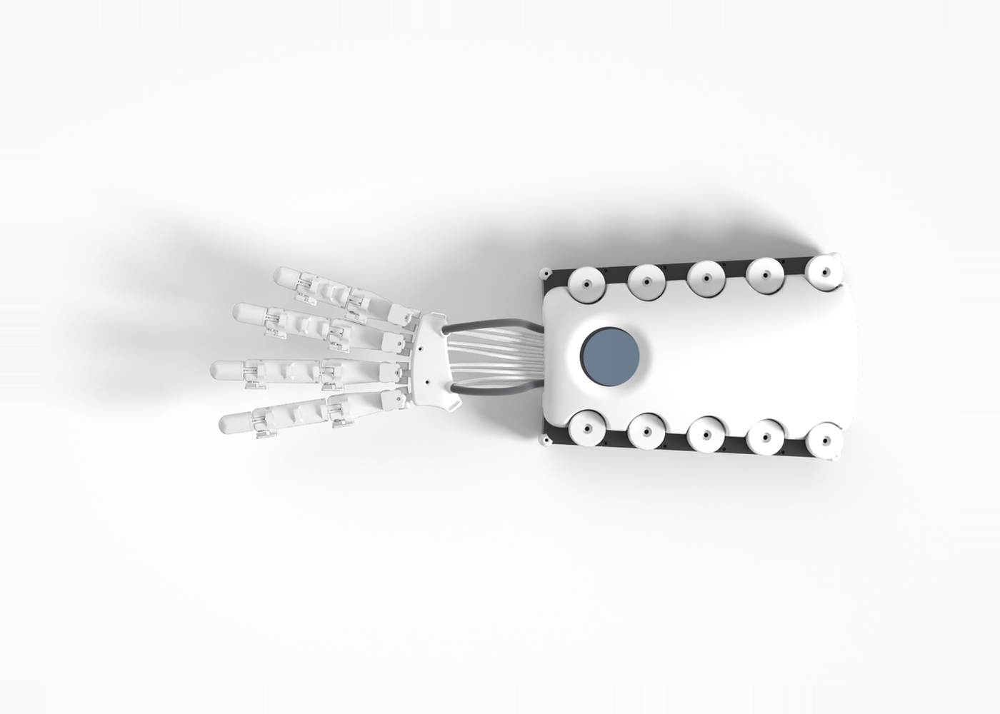</td>
<td width="50%">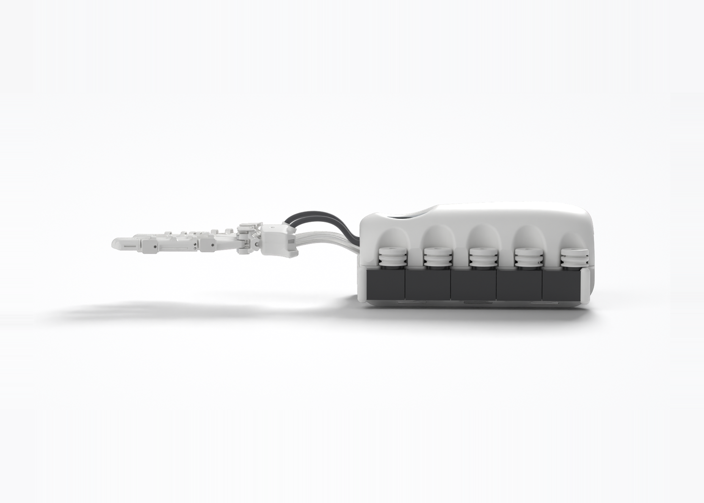</td>
</tr>
<tr>
<td align="center"><sub><b>Plan</b>, ten tendon spools, twelve instrumented joints</sub></td>
<td align="center"><sub><b>Profile</b>, actuator bank and forearm shell</sub></td>
</tr>
</table>

## Inside it

Two custom boards, designed from scratch. Full KiCad sources and manufacturing outputs are in
[`electronics/`](electronics/), these renders come straight from those files.

<table>
<tr>
<td width="42%">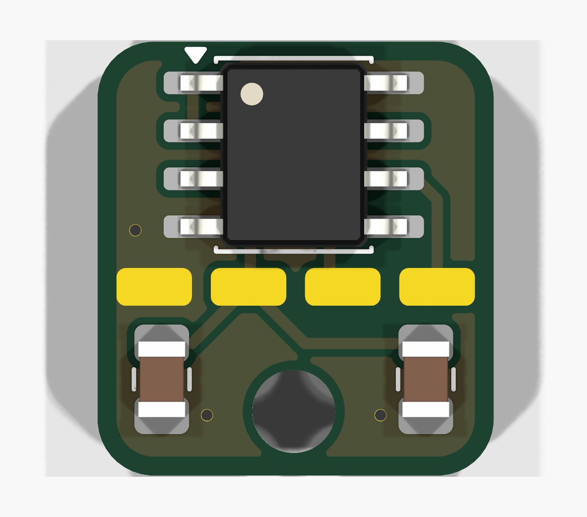</td>
<td width="58%">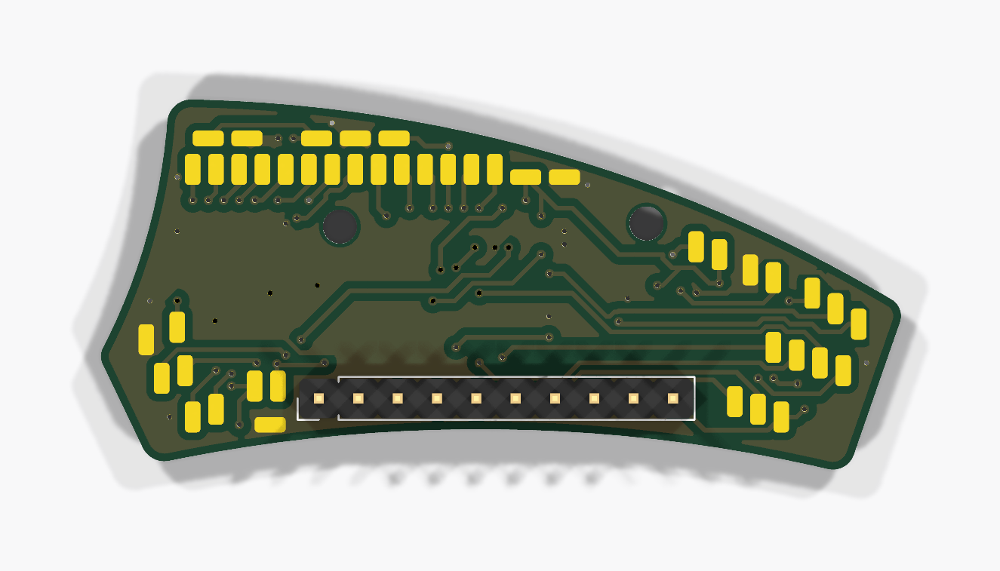</td>
</tr>
<tr>
<td align="center"><sub><b>Encoder board</b>, AS5600 magnetic angle sensor, one per joint</sub></td>
<td align="center"><sub><b>Palm carrier</b>, shaped to the hand, multiplexes the encoder fan-out</sub></td>
</tr>
</table>

## How it fits together

Sensing → aggregation → control → interface:

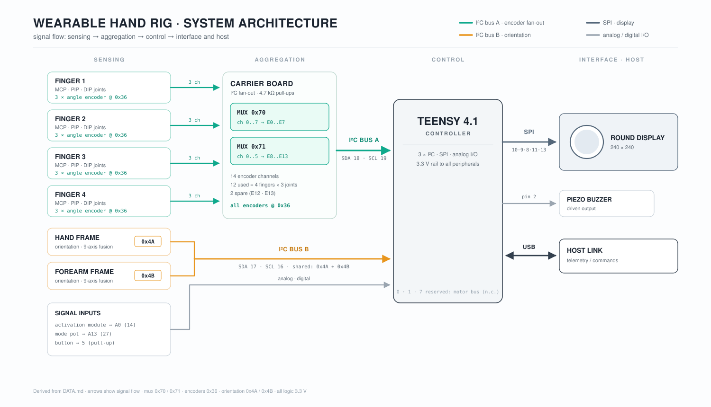

And the full point-to-point wiring, every pin terminated, both I²C multiplexers, all fourteen
encoder channels, three IMUs, and the 74HC241 servo bus. The
[PDF](docs/global-wiring.pdf) is the printable version.

<a href="docs/global-wiring.pdf">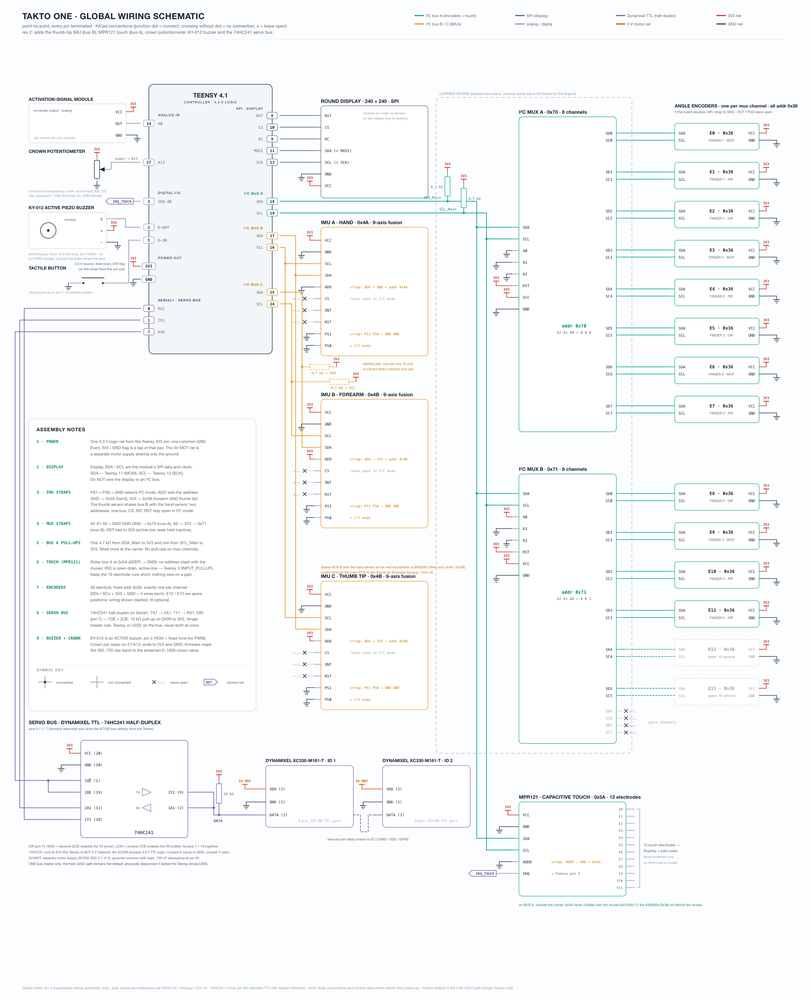</a>

---

## Start here

**Read [`docs/README.md`](docs/README.md) first**, system architecture, the illustrated build
guide, and the known corrections between the documentation and the current hardware.

```bash
git clone https://github.com/molanocortes/takto-one.git
cd takto-one

# see the console and 3D twin immediately, no hardware needed
python3 -m http.server 8096 --directory software/console/app
# open http://localhost:8096/
```

| Step | Where |
| --- | --- |
| Choose and print parts | [`cad/README.md`](cad/README.md) |
| Order and wire the boards | [`electronics/README.md`](electronics/README.md) |
| Flash the Teensy | [`firmware/README.md`](firmware/README.md) |
| Connect the twin to hardware | [`software/README.md`](software/README.md) |

The embedded Dynamixel driver is also maintained standalone as
[**dynamixel-on-device**](https://github.com/molanocortes/dynamixel-on-device).

---

## The software that ships with it

Two browser surfaces, one data path. Both run with **no hardware at all**, the bridge's `--sim`
mode feeds synthetic joints, so you can explore the whole stack before you print a single part.
The browser sees the stream at 60 Hz, which is a display rate, not the device's limit (see
[On rates](#a-note-on-rates)). Every twin below renders the same articulated geometry that
ships in [`cad/`](cad/).

<div align="center">

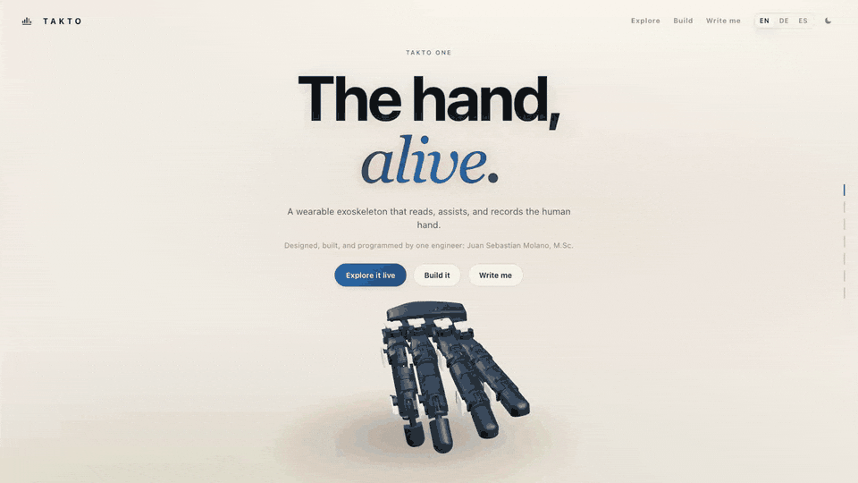

<sub><b>The public front end.</b> One scroll-driven story: the device turns, the fingers move,
and each claim sits next to the part of the machine that makes it.</sub>

</div>

<div align="center">

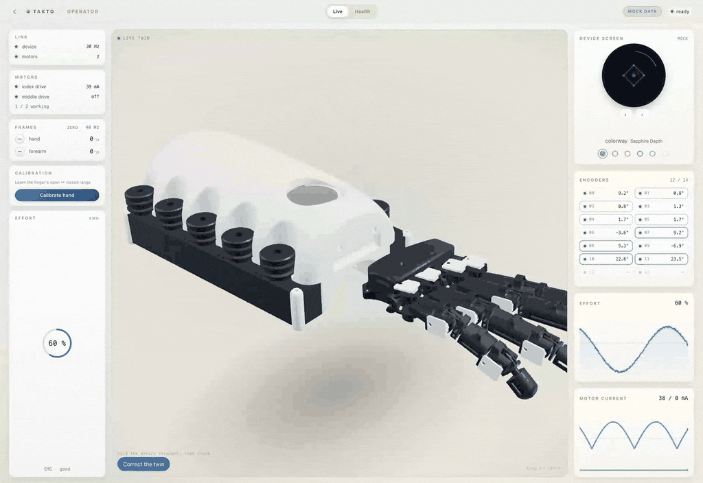

<sub><b>The operator console.</b> Live 3D twin, twelve per-joint encoders, motor state, EMG
effort, current draw, the device's own round screen, and calibration. Shown on the simulator,
which is why the encoder column is populated and the link reads <i>mock</i>.</sub>

</div>

### Built on the same stream, not in this release

<div align="center">

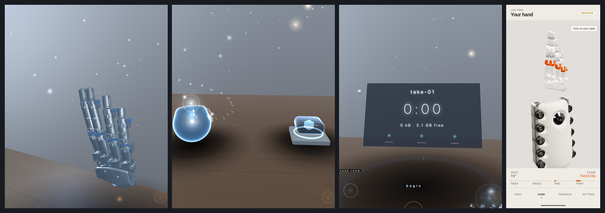

<sub><b>AR layer</b> — the worn hand twin, the touch module, and capture, shown in the desktop
preview of the headset scene &nbsp;·&nbsp; <b>Android companion</b> — sessions and the twin on a
phone, in practice mode.</sub>

</div>

> **The AR layer and the Android companion are working prototypes, not polished products,** and
> the images above are simulator and emulator captures rather than a headset or a handset. The
> Android source is not in this release; the sign-language stack is not either. Everything else
> shown here is included.
>
> The website ships **without** `assets/docs/`. That folder holds the submitted thesis, an
> unpublished manuscript and the CAD submission archive, none of which are distributed. The
> preprint call-to-action was removed with it.

## The device screen

The Teensy drives a round display, and the face engine that paints it is part of the firmware.
Three faces ship, each covering every device state: battery, boot, calibrate, fault, idle,
linked, recording, saved, standalone, stop and teleop.

<div align="center">

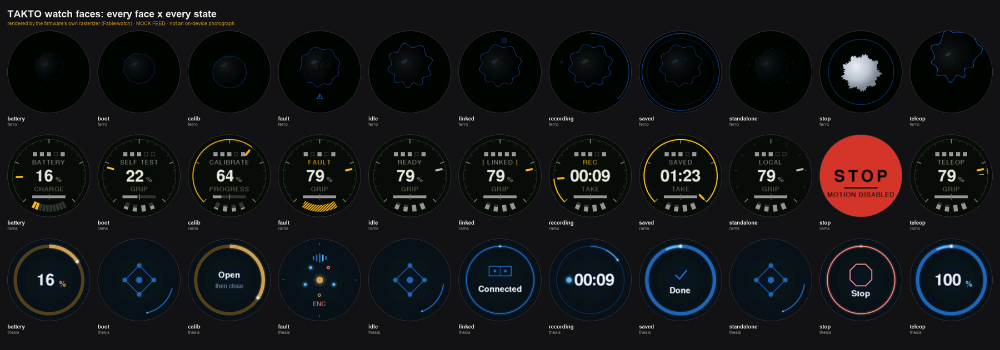

<sub>Every face against every state, rendered by the firmware's own rasterizer from a mock feed.
These are not photographs of the physical screen.</sub>

</div>

The **thesis** face is the one used throughout the thesis work. Source, the face engine, the
frame budget and the flashing runbook are in
[`firmware/takto_one/watch/`](firmware/takto_one/watch/).

## Sign language: a worked example

The clearest demonstration that this is a platform and not a single-purpose device is
**TAKTO-SIGN**, a German Sign Language capture, training and live-recognition stack built
on exactly this hardware. It records finger bend and hand orientation at 60 Hz, learns a
designed vocabulary, and recognises signs live. Like everything else here, it runs end to end
with no hardware through `--sim`.

Its own scope statement is worth repeating, because it is the right way to talk about work like
this: it is a **signer-dependent isolated-sign recogniser**, with a continuous scripted-sentence
path and a measured cross-signer result. **It is not open-vocabulary translation.**

That is one application, built by one person, on this platform. It is meant as an example of
what the hardware supports, not as the limit of it.

## Where the project really stands

Being precise about this matters more than a longer feature list.

**Verified on hardware.** The firmware runs on the device. The Teensy owns the Dynamixel bus
through the 74HC241 and drives the fingers. All twelve magnetic encoders read live together and
feed the browser digital twin in real time. Four long-finger assemblies are physically built and
instrumented, and both PCBs exist as manufactured designs with complete sources.

**Not established by this repository.** Force rendering, transparency control, and assistance
behavior are not characterized here. Timing figures need care: internal loop rate, telemetry
rate, console update rate, and end-to-end latency are different quantities and are not
interchangeable. Verify the installed IMUs, thumb configuration, actuator count, limits, and
safety behavior on your own hardware before any worn experiment. Repository-preparation checks
are recorded in the [verification record](docs/RELEASE_VERIFICATION.md).

### A note on rates

Loop rate, sampling rate, telemetry rate and console update rate are four different numbers, and
collapsing them into one is the easiest way to mislead someone.

- **Browser console: 60 Hz.** The bridge broadcasts snapshots to connected browsers at 60 Hz,
  chosen so a fresh sample never waits more than one tick to ship. This is a *display* rate.
- **Firmware streaming default: 50 Hz.** `SAMPLE_HZ` in the shipped sketch. Also an interface
  number, it is what gets emitted over the serial line for the host to draw.
- **Embedded control loop: up to 2 kHz.** The control law runs on the Teensy next to the
  actuator, not on a host.
- **On-device capture is not bound by any of the above.** If you do not need a live browser UI,
  the streaming rate is a firmware constant you can change, and logging can run considerably
  faster than what the console displays.

The ceiling on encoder sampling is set by the I²C bus and multiplexer switching, and **it has not
been characterised here.** If your application depends on a specific rate, measure it on your own
build rather than taking a number from this page.

**Known limitations, stated plainly.** Ten motors makes this an expensive build. The
series-elastic actuation is a simple implementation, elastic tendons and ratchet spools, not
an advanced SEA design. Recent soft-robotics work achieves comparable joint and force sensing
with simpler mechanisms. This is a working, well-instrumented research platform, not a claim to
the state of the art. Those gaps are exactly where contributions would help most.

## Safety

> TAKTO ONE is an experimental research prototype. **It is not a medical device and not a
> certified protective product.** Do not use it for diagnosis, treatment, unsupervised
> rehabilitation, or safety-critical operation.

Keep actuator power independently removable, begin with torque disabled, test away from the
body, confirm mechanical limits, and validate watchdog and fault behavior before any worn
experiment.

---

## Contributing

**This project is actively developed and contributions are genuinely wanted.** It is a research
platform, not a finished product, and the limitations above are open invitations.

Good places to start:

- **Build one**, and tell us what was unclear, what did not fit, what you changed. Build
  reports are the single most valuable contribution.
- **Improve the actuation**, a better series-elastic design is the most interesting open problem here.
- **Reduce the motor count**, ten is expensive; underactuation would widen who can build this.
- **Fix documentation**, known deltas are listed in [`docs/README.md`](docs/README.md); find more.
- **Firmware, bridge, console**, bugs, features, and platform ports.

See [`CONTRIBUTING.md`](CONTRIBUTING.md). Open an issue with questions, ideas, or photos of your
build, showing what you made is always welcome.

## License

Software **Apache-2.0** · Hardware **CERN-OHL-S-2.0** · Documentation and media **CC-BY-4.0**.
Full detail, attribution format, and the text-and-data-mining reservation: [`LICENSE.md`](LICENSE.md).

The hardware licence is strongly reciprocal: distribute a modified design and you publish your
modifications. If that does not suit your situation, **licensing on other terms is available**,
see [`LICENSE.md`](LICENSE.md). Contributors are asked to agree to a short [CLA](CLA.md), which
keeps relicensing possible and leaves your copyright with you.

<div align="center">
<sub>Designed and built by Sebastian Molano · Hochschule Anhalt · Made in Germany</sub>
</div>
