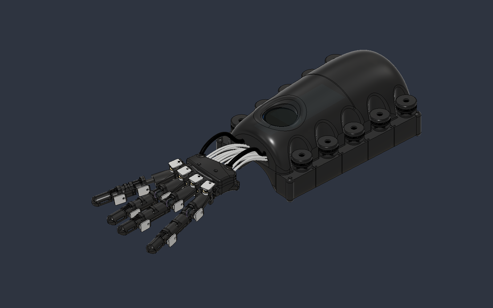
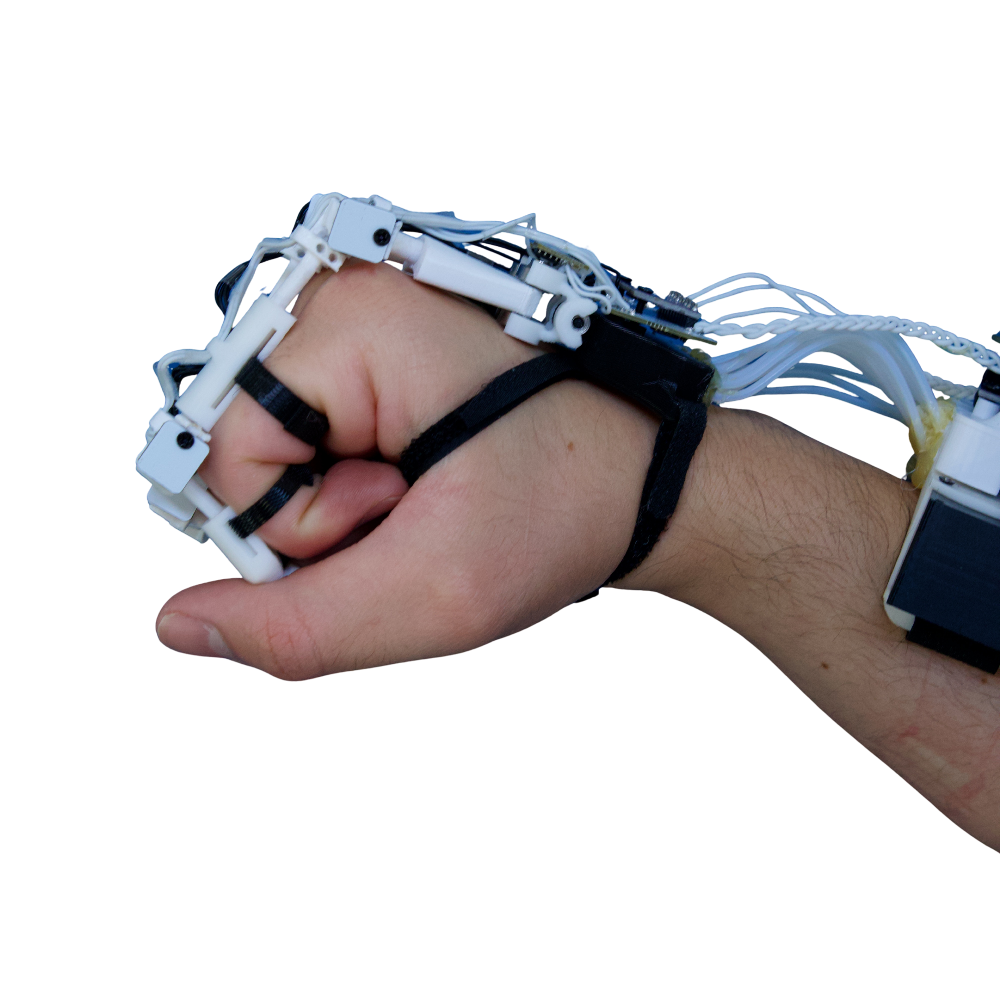

# TAKTO ONE

TAKTO ONE is a sensor-integrated, tendon-driven hand exoskeleton and robotics research platform developed by Sebastian Molano. It combines wearable mechanics, magnetic joint sensing, embedded control, custom electronics, data capture, and a live web-based digital twin.

This repository is a clean engineering release. It contains the current files needed to inspect and extend the platform without the private thesis, historical iterations, personal scan geometry, order records, or unrelated experiments.

## What is included

| Area | Contents |
| --- | --- |
| [`cad/`](cad/) | Current mechanical parts exported from Fusion as print-ready STL and neutral STEP files |
| [`electronics/`](electronics/) | KiCad sources and manufacturing outputs for the encoder board and palm carrier |
| [`firmware/`](firmware/) | The unified Teensy 4.1 firmware, including sensing, display, recording, and Dynamixel support |
| [`software/`](software/) | A focused operator console, live 3D hand twin, and the serial-to-WebSocket bridge |

The CAD files were exported on 2026-08-27 from `Zero_Final_Assembly_Complete` version 35. Fusion reported that the assembly was current and had no out-of-date child references. Only TAKTO-authored mechanical bodies were exported; the hidden arm scan and third-party reference models were deliberately excluded.

## Release preparation record

The public-release candidate was assembled and checked on 2026-08-27. This record is included so the release can be independently reviewed.

- Opened the live `Zero_Final_Assembly_Complete` Fusion document and confirmed version 35 was the latest complete version, with no out-of-date child references.
- Exported 24 TAKTO-authored components as binary STL and 23 solid components as STEP. `BaseSpool` is mesh-only in the current Fusion assembly, so it is provided as STL only. Component versions and required quantities are recorded in [`cad/README.md`](cad/README.md).
- Parsed every exported STL to verify its triangle count, file length, finite coordinates, and plausible bounds. Checked every STEP file for a complete ISO 10303-21 envelope.
- Included only the current Teensy firmware, the two current KiCad projects and manufacturing outputs, and the focused operator console and bridge. Historical branches and unfinished AR/Android releases were not copied.
- Compiled the included firmware successfully for a Teensy 4.1. The checked build used 154,508 bytes of program code, 60,300 bytes of initialized data, 52,768 bytes of RAM1 variables, and 250,496 bytes of RAM2 variables.
- Started the bridge simulation through sensor and catalog initialization with 12 synthetic joints, two IMUs, and EMG. A clean end-to-end WebSocket listener test was not completed because the attempted local ports were already occupied; hardware communication was not retested as part of repository preparation.
- Scanned the candidate for common secret patterns, private absolute paths, oversized files, and symbolic links. No such release blockers were found. The two published PNGs expose no author, camera, creation-time, description, or GPS metadata in the checked metadata fields.
- Kept the private thesis, personal arm scan, vendor CAD, account/order data, stale build guides, private photos, and unrelated experiments out of the release.
- Identified the vendored Three.js files and preserved their MIT terms in [`THIRD_PARTY_NOTICES.md`](THIRD_PARTY_NOTICES.md).

These checks establish release-file integrity, not medical, mechanical, electrical, or worn-actuation certification. A second reviewer should still inspect the exact repository tree and licensing before publication.

## Verified project state

- Four long-finger assemblies are physically built.
- All 12 magnetic joint encoders have been read live together and visualized in the web twin.
- The as-built prototype uses a mixture of PETG and PLA.
- The Teensy 4.1 can own the Dynamixel bus through a 74HC241 half-duplex interface. A host computer is optional for visualization and logging, not inherently required for the embedded motor loop.
- Two custom PCB designs and their manufacturing outputs are included.

The firmware supports additional sensors and motor-control modes, but a source-code path is not the same as a validated worn behavior. Verify the installed IMUs, thumb configuration, actuator count, limits, and safety behavior on the exact hardware before use.

## Start here

1. Review [`cad/README.md`](cad/README.md) and choose the STEP or STL files you need.
2. Review [`electronics/README.md`](electronics/README.md) before ordering boards or wiring the motor bus.
3. Build the Teensy sketch using [`firmware/README.md`](firmware/README.md).
4. Run the digital twin in mock mode, then connect it to hardware using [`software/README.md`](software/README.md).

The embedded Dynamixel implementation is also maintained as the dedicated [`dynamixel-on-device`](https://github.com/molanocortes/dynamixel-on-device) project.

## Safety

TAKTO ONE is an experimental research prototype, not a medical device or certified protective product. Do not use it for diagnosis, treatment, unsupervised rehabilitation, or safety-critical operation. Keep actuator power independently removable, begin with torque disabled, test away from the body, confirm mechanical limits, and validate watchdog and fault behavior before any worn experiment.

## Deliberately not included

- The submitted master's thesis
- Personal arm-scan geometry
- Historical CAD and firmware branches
- Vendor CAD models
- JLCPCB account and order history
- AR and Android prototypes that are not ready for a polished release
- Papers, application documents, private photos, and build guides with stale technical claims

## License status

The final licensing structure is still under review because the software, electronics, CAD, documentation, and media may require different terms. Until explicit licenses are added, the TAKTO-authored files are publicly viewable but no permission to copy, modify, redistribute, commercialize, or train AI systems on them is granted. See [`LICENSE.md`](LICENSE.md) and [`THIRD_PARTY_NOTICES.md`](THIRD_PARTY_NOTICES.md).

Copyright © 2026 Sebastian Molano.
