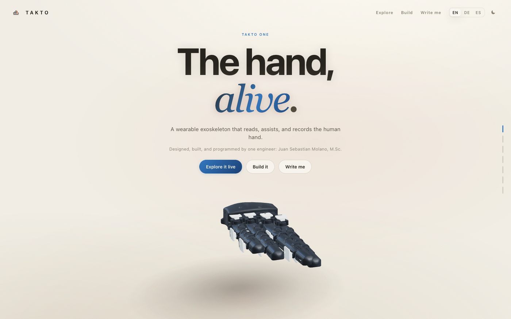
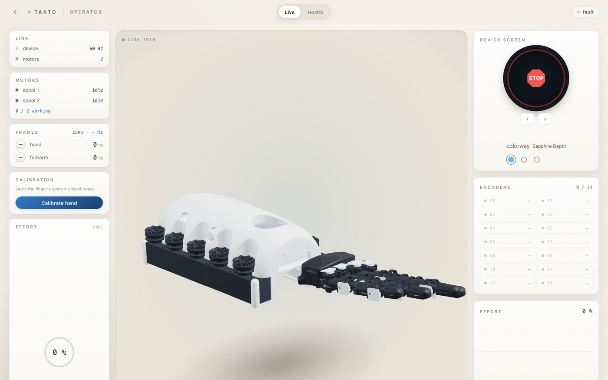
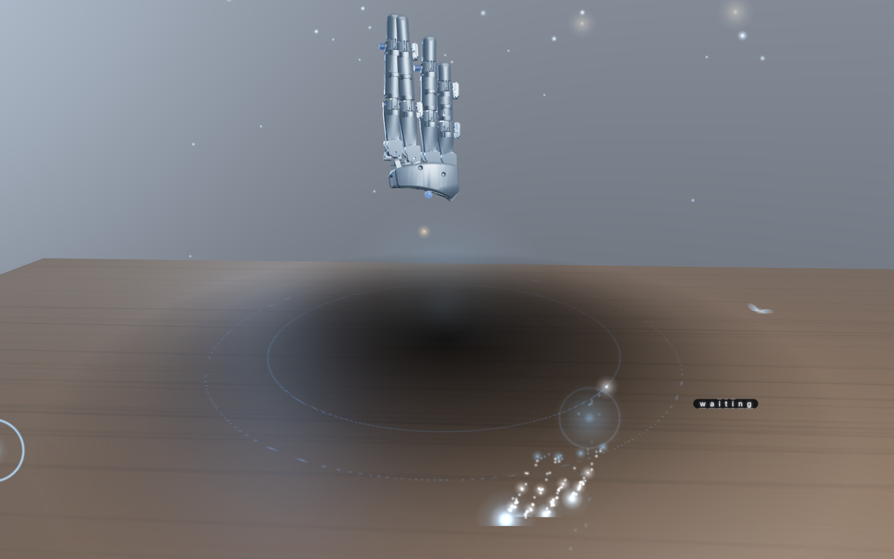
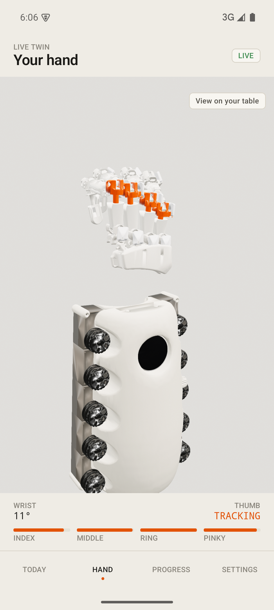

<div align="center">


# TAKTO ONE

### Open hand control. Read every finger. Drive every finger.

TAKTO ONE measures the angle of **twelve finger joints at 60 Hz** and can pull them back through
tendons. It is a wearable platform for reading the human hand precisely, and for putting force
back into it — with every file needed to build one.

[](LICENSE.md)
[](LICENSE.md)
[](LICENSE.md)
[](firmware/)
[](CONTRIBUTING.md)

</div>

---

## Why a hand, and why this one

A camera watching your hand loses fingers the moment they cross, curl, or leave frame. A glove
full of flex sensors drifts. TAKTO ONE puts a **magnetic encoder on the joint itself** — three
per finger, twelve in all — so the measurement does not care about occlusion, lighting, or where
you are standing. The microcontroller owns the motor bus, so the device does not need a computer
in the loop to act.

That combination — **per-joint truth going in, tendon force coming out, no host required** — is
what makes it a platform rather than a gadget. It is a hand-shaped input and output device, and
what you point it at is up to you.

## What people could build with this

**None of the following is a finished feature.** They are the directions this hardware opens,
listed because the reason to open-source a platform is that other people take it somewhere the
author could not. What is actually built and measured today is in
[Where the project really stands](#where-the-project-really-stands) below.

| | |
| --- | --- |
| 🤖 **Teleoperate a robot hand** | Your fingers become the controller. Per-joint angles map onto a robot hand directly, without a camera rig or a motion-capture volume. Reach further than the operator can stand: an undersea manipulator, a hot cell, a machine on another continent. |
| 🧠 **Generate training data machines can trust** | Vision-based hand datasets inherit vision's blind spots. Joint encoders give clean, occlusion-free, per-joint ground truth at 60 Hz — labelled by physics rather than by a model's guess. Untethered, so the data comes from real tasks rather than a capture studio. |
| 🤟 **Sign language capture and recognition** | Already underway, not speculation — see [Sign language](#sign-language-a-worked-example) below. |
| 🎮 **Force feedback, per finger** | A PlayStation 5 trigger can vary its resistance as you press. This device has a tendon and a motor on each finger, so the same idea generalises: feel a virtual wall, a trigger pull, the give of tissue, the weight of a load — finger by finger rather than through one rumbling handle. |
| 🩺 **Rehabilitation and assessment** | Range of motion measured objectively, session over session, instead of estimated by eye. Assisted movement for a hand that cannot complete it alone. |
| 🕹️ **High-precision machine control** | Operating equipment where a joystick is too blunt and a touchscreen is impossible — gloved, wet, in the dark, or while your eyes are needed elsewhere. |
| 🥊 **Whatever you are actually here for** | A boxer driving a sparring robot, a surgeon rehearsing at distance, a musician mapping fingers to synthesis. The platform does not care. |

The honest version: **the hardware to sense and actuate is here and working. Almost all of that
list is unbuilt.** That is the invitation, and it is why the project is open rather than
protected.

## The machine

| | |
| --- | --- |
| **Mechanism** | Tendon-driven, four instrumented long-finger assemblies |
| **Actuation** | Series-elastic, through elastic tendons and ratchet-based spools |
| **Joint sensing** | 12 × AS5600 magnetic encoders, 3 per finger, read live together |
| **Controller** | Teensy 4.1 |
| **Motor bus** | Dynamixel Protocol 2.0 over a 74HC241 half-duplex interface — **the microcontroller owns the bus; no host PC required** |
| **Electronics** | 2 custom PCBs, full KiCad sources + manufacturing outputs |
| **Interface** | Browser operator console with a live 3D twin, over a serial→WebSocket bridge |
| **Structure** | 3D printed; as built, a mix of PETG and PLA |

---

<div align="center">


</div>

---

## Every angle

<table>
<tr>
<td width="50%"></td>
<td width="50%"></td>
</tr>
<tr>
<td align="center"><sub><b>Plan</b> — ten tendon spools, twelve instrumented joints</sub></td>
<td align="center"><sub><b>Profile</b> — actuator bank and forearm shell</sub></td>
</tr>
</table>

## Inside it

Two custom boards, designed from scratch. Full KiCad sources and manufacturing outputs are in
[`electronics/`](electronics/) — these renders come straight from those files.

<table>
<tr>
<td width="42%"></td>
<td width="58%"></td>
</tr>
<tr>
<td align="center"><sub><b>Encoder board</b> — AS5600 magnetic angle sensor, one per joint</sub></td>
<td align="center"><sub><b>Palm carrier</b> — shaped to the hand, multiplexes the encoder fan-out</sub></td>
</tr>
</table>

## How it fits together

Sensing → aggregation → control → interface:


And the full point-to-point wiring — every pin terminated, both I²C multiplexers, all fourteen
encoder channels, three IMUs, and the 74HC241 servo bus. The
[PDF](docs/global-wiring.pdf) is the printable version.

<a href="docs/global-wiring.pdf"></a>

---

## Start here

**Read [`docs/README.md`](docs/README.md) first** — system architecture, the illustrated build
guide, and the known corrections between the documentation and the current hardware.

```bash
git clone https://github.com/molanocortes/takto-one.git
cd takto-one

# see the console and 3D twin immediately, no hardware needed
python3 -m http.server 8096 --directory software/console/app
# open http://localhost:8096/
```

| Step | Where |
| --- | --- |
| Choose and print parts | [`cad/README.md`](cad/README.md) |
| Order and wire the boards | [`electronics/README.md`](electronics/README.md) |
| Flash the Teensy | [`firmware/README.md`](firmware/README.md) |
| Connect the twin to hardware | [`software/README.md`](software/README.md) |

The embedded Dynamixel driver is also maintained standalone as
[**dynamixel-on-device**](https://github.com/molanocortes/dynamixel-on-device).

---

---

## The software that ships with it

Four surfaces, all reading the same 60 Hz stream from the device. All of them run with **no
hardware at all** — the bridge's `--sim` mode feeds synthetic joints, so you can explore the
whole stack before you print a single part.

<table>
<tr>
<td width="50%"></td>
<td width="50%"></td>
</tr>
<tr>
<td align="center"><sub><b>Web front end</b> — the project's public face</sub></td>
<td align="center"><sub><b>Operator console</b> — live 3D twin, per-joint encoders, motor state, calibration</sub></td>
</tr>
</table>

<table>
<tr>
<td width="62%"></td>
<td width="38%"></td>
</tr>
<tr>
<td align="center"><sub><b>AR layer</b> — the hand twin and capture, touch and rhythm modules in space</sub></td>
<td align="center"><sub><b>Android companion</b> — sessions and twin on a phone</sub></td>
</tr>
</table>

> The AR and Android layers are **working prototypes, not polished products.** They are included
> because they show the shape of the platform, and because they are more useful in your hands
> than on a private disk.

## Sign language: a worked example

The clearest demonstration that this is a platform and not a single-purpose device is
**TAKTO-SIGN** — a German Sign Language capture, training and live-recognition stack built
on exactly this hardware. It records finger bend and hand orientation at 60 Hz, learns a
designed vocabulary, and recognises signs live. Like everything else here, it runs end to end
with no hardware through `--sim`.

Its own scope statement is worth repeating, because it is the right way to talk about work like
this: it is a **signer-dependent isolated-sign recogniser**, with a continuous scripted-sentence
path and a measured cross-signer result. **It is not open-vocabulary translation.**

That is one application, built by one person, on this platform. It is meant as an example of
what the hardware supports — not as the limit of it.

## Where the project really stands

Being precise about this matters more than a longer feature list.

**Verified on hardware.** The firmware runs on the device. The Teensy owns the Dynamixel bus
through the 74HC241 and drives the fingers. All twelve magnetic encoders read live together and
feed the browser digital twin in real time. Four long-finger assemblies are physically built and
instrumented, and both PCBs exist as manufactured designs with complete sources.

**Not established by this repository.** Force rendering, transparency control, and assistance
behavior are not characterized here. Timing figures need care: internal loop rate, telemetry
rate, console update rate, and end-to-end latency are different quantities and are not
interchangeable. Verify the installed IMUs, thumb configuration, actuator count, limits, and
safety behavior on your own hardware before any worn experiment. Repository-preparation checks
are recorded in the [verification record](docs/RELEASE_VERIFICATION.md).

**Known limitations, stated plainly.** Ten motors makes this an expensive build. The
series-elastic actuation is a simple implementation — elastic tendons and ratchet spools — not
an advanced SEA design. Recent soft-robotics work achieves comparable joint and force sensing
with simpler mechanisms. This is a working, well-instrumented research platform, not a claim to
the state of the art. Those gaps are exactly where contributions would help most.

## Safety

> TAKTO ONE is an experimental research prototype. **It is not a medical device and not a
> certified protective product.** Do not use it for diagnosis, treatment, unsupervised
> rehabilitation, or safety-critical operation.

Keep actuator power independently removable, begin with torque disabled, test away from the
body, confirm mechanical limits, and validate watchdog and fault behavior before any worn
experiment.

---

## Contributing

**This project is actively developed and contributions are genuinely wanted.** It is a research
platform, not a finished product, and the limitations above are open invitations.

Good places to start:

- **Build one** — and tell us what was unclear, what did not fit, what you changed. Build
  reports are the single most valuable contribution.
- **Improve the actuation** — a better series-elastic design is the most interesting open problem here.
- **Reduce the motor count** — ten is expensive; underactuation would widen who can build this.
- **Fix documentation** — known deltas are listed in [`docs/README.md`](docs/README.md); find more.
- **Firmware, bridge, console** — bugs, features, and platform ports.

See [`CONTRIBUTING.md`](CONTRIBUTING.md). Open an issue with questions, ideas, or photos of your
build — showing what you made is always welcome.

## License

Software **Apache-2.0** · Hardware **CERN-OHL-S-2.0** · Documentation and media **CC-BY-4.0**.
Full detail, attribution format, and the text-and-data-mining reservation: [`LICENSE.md`](LICENSE.md).

<div align="center">
<sub>Designed and built by Sebastian Molano · Hochschule Anhalt · Made in Germany</sub>
</div>
