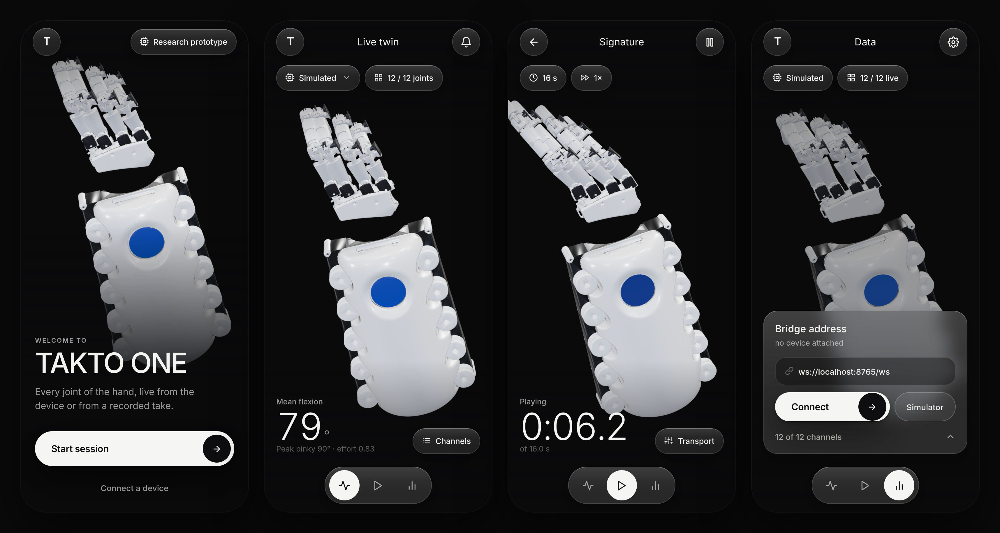

# TAKTO companion

A digital twin and instrument panel for TAKTO ONE, for iOS, Android and the
browser from one codebase.

<div align="center">

</div>

Three surfaces on one data path:

| | |
| --- | --- |
| **Live** | The device now. The articulated twin above, the twelve joints and the activation channel below. |
| **Replay** | A recorded session played back into the same twin, with a scrubber over the take's own effort trace. |
| **Data** | The channels themselves, what each one measures, and where the stream is coming from. |

Everything runs with **no hardware attached**. The app opens on a synthetic
feed and says so on every screen; point it at a bridge when you have a device.

## Run it

```bash
npm install
npx expo start
```

Then press `w` for the browser, `i` for an iOS simulator, or `a` for Android.
A native run builds through Expo in the usual way (`npx expo run:ios`,
`npx expo run:android`) and needs the corresponding platform toolchain.

To drive it from real hardware, start the bridge and give the app its address
on the Data screen:

```bash
SENSORYHAND_STATE_DIR=.takto-state python3 ../bridge/teensy_bridge.py --sim
```

`--sim` feeds synthetic joints; swap it for `--port /dev/cu.usbmodemXXXX` with
a Teensy attached. The default address is `ws://localhost:8765/ws`; from a
phone, use the machine's LAN address instead of localhost.

## What it is built on

- **The real CAD, at full resolution.** `assets/model/zero_hand_full.glb` is the
  repository's own export of the V7 assembly, 607k triangles, names and
  transforms untouched. It ships without normals, so the loader welds its
  vertices and computes smooth ones; `zero_hand.glb` (143k, web-decimated)
  stays beside it for low-memory devices, switched by one constant in
  `src/twin/loadHand.ts`. The rig binds to the GLB's own node names, because
  those names are the mechanism.
- **The shared mechanical model.** `src/data/kinematics.js` is carried
  byte-for-byte from `software/console`. Joint angles, the telescopic slides
  they demand, and the spool rotations that produce them all come from there.
  Nothing in the twin is tuned by eye.
- **The real take format.** The three bundled sessions are the repository's own
  samples from `software/bridge/samples/`, and a take recorded by the device
  drops in unchanged.
- **The real wire contract.** The bridge client reads the same `snap` frames
  the operator console reads.

## The look

The machine fills the screen on one tone of black, and everything you touch
is liquid glass floating over it. Four rules keep it honest:

- **One stage, one subject.** The twin ships in the `midnight` look: one
  matte tone of deep blue, lighter spools and pins, the screen glowing. One
  warm key, one cool rim, a front fill and a neutral room environment
  through a filmic transform. No floor, no gradient: the machine is the only
  thing lit. Seventeen other looks live in `src/twin/materials.ts` (matte
  tones, ceramic, frost, and x-ray tints) behind `?look=` on the web build,
  and `?part=hand` renders the hand without the housing; `DEFAULT_LOOK` in
  `src/twin/Twin.tsx` picks the shipped one.
- **Glass, not cards.** Every control is a lens: backdrop blur, a faint milk
  fill, a highlight pooling along the top edge, a rim brightest on the lit
  side, a soft lift. The header's round buttons, the picker chips, the nav,
  the segmented control and the sheet all sit on the same `Glass` surface.
- **Nothing on the twin.** The summary number stands on the stage with no
  card under it. Detail lives in a sheet that is hidden until asked for and
  is glass when it comes.
- **Light type, one accent.** Inter throughout, weight 300 for the big
  numerals, tabular so tickers hold still. The accent is spent only on
  state: a live channel, a value at its limit, the playhead.

Tokens are stated once in `src/ui/tokens.ts`; the shapes every screen is
built from are `src/ui/primitives.tsx` and `src/ui/Chrome.tsx`.

## Honest limits

- The twin renders **the mechanism**, not a person. Wrist articulation from the
  IMUs is not applied yet, and the thumb is sensing-only on the device.
- The screen on the forearm lights with activity. That is the glass lighting
  up, not a capture of the panel: the model carries no display content.
- The bundled takes are **choreographed and synthetic**, by their own README's
  admission. No hand wore the device to make them. The live synthetic feed is
  the same kind of thing: a 32 s choreography in `src/data/sim.ts` that rests
  open and spread, and departs from that pose into taps, a bloom, a wave and
  a grasp.
- The samples write anatomical values into the `{f}_mcp` column, which the
  device's wire contract uses for MCP **abduction**. This app maps columns the
  same way `software/web/src/views/replay.js` does, so replayed abduction can
  read past the mechanism's 16 degree limit. The transport says so and the
  twin clamps it.
- The full mesh is 10.9 MB in the bundle and 607k triangles on the GPU. It
  renders at 60 Hz on a laptop's software GL; on a low-end phone, flip
  `MODEL` in `src/twin/loadHand.ts` to `lite`.
- Verified on the **web** target, which is also what the capture tool renders
  and what every image on this page came from. The iOS and Android bundles
  export from the same source (`npx expo export --platform ios` and
  `--platform android`), but neither has been run on a device or a simulator
  here, so treat the native targets as compiling rather than as exercised.
  `expo-blur` on Android needs `experimentalBlurMethod` to blur at all, which
  is an open item for the first device run.

## Regenerating the media

The synthetic feed is a pure function of time and the app accepts `?t=`,
`?screen=` and `?take=`, so every captured frame is reproducible. See
[`tools/capture.mjs`](tools/capture.mjs) for the stills and the loop frames,
[`tools/compose.mjs`](tools/compose.mjs) for the docs composite, and
[`tools/gif.mjs`](tools/gif.mjs) for the loop.
