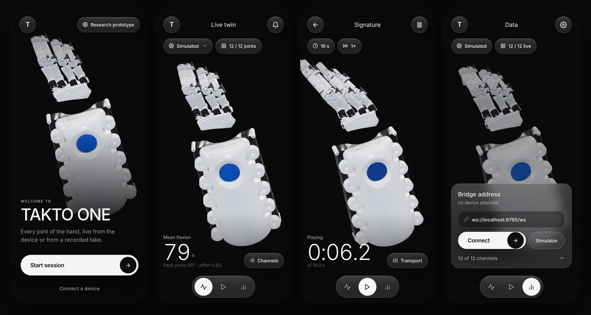

# TAKTO companion

A digital twin and instrument panel for TAKTO ONE, for iOS, Android and the
browser from one codebase.

<div align="center">

</div>

Six surfaces on one data path:

| | |
| --- | --- |
| **Home** | The device at a glance: the twin lying on the page (its wrist now follows the IMUs), the system health number and its trace, four housekeeping channels, the battery and the mode. |
| **Twin** | The device on the wearer's arm. *Arm in space* draws the body frame of `software/MOTION_PIPELINE.md` (shoulder at the origin, a faint upper arm, forearm and torso) and places the forearm at `wrist_m` with `forearm_quat`, the hand at the wrist with `hand_quat`. *Hand only* holds the forearm still and articulates the wrist, so the fingers read at full size. Below: wrist flexion / deviation / pronation, elbow / wrist / palm positions, the position source, and which fingers report. |
| **Record** | Start and stop the bridge's one shared recording with a task, subject and notes; the running take's elapsed time and sample count from the snapshot's `session` block; the device's SD state from the `device` block (card present, recording to card, take number, rows, auto-record, standby, boot); and the neutral calibration with the device's countdown, hold and done. |
| **Takes** | The bridge's take library (`{kind:"takes"}`), each replayable (rows fetched with `take_data`); the device's SD card (`{kind:"sd_takes"}`) with Import and a progress bar; and three bundled demo takes, labelled as synthetic, for when there is no bridge. A replay has a real transport: play / pause, a draggable scrubber, 0.25x to 2x, eject. |
| **Data** | The twelve joints and the activation channel as traces, finger by finger. |
| **Link** | The bridge address, the connection state in plain words and its rate, recent addresses, the bridge's own LAN address when it reports one, and the steps to reach a PC from a phone. |

**One label, never ambiguous.** The top row of every screen says where the
numbers come from, and a tap on it opens Link:

- **LIVE** (green): a real device, through an open bridge that is delivering
  frames right now.
- **SIMULATED** (amber): the in-app synthetic feed, *or* a bridge running
  `--sim` (the app reads that from the snapshot's health block and refuses to
  call it live).
- **REPLAY** (blue): a take is playing; the detail says when it is a demo or
  simulated take. The source keeps running underneath, and ejecting the take
  returns to it (the socket is not dropped).
- **CONNECTING / OFFLINE / PAUSED** (red): no data. The twin freezes on the
  last real frame and says so; nothing is invented to fill the gap.

The session has one writer for the displayed frame (the animation loop): the
socket only stores the bridge's newest snapshot, and a replay overlays it.

Everything also runs with **no hardware attached**. The app opens on the
in-app simulator, which is a stand-in for the bridge as well as the device:
the arm moves (a reach, a lift, forearm roll, wrist flexion), recording
produces takes with the v16 body columns, the neutral capture counts down,
and two fake SD files can be imported. All of it is labelled SIMULATED and
lives in memory until the app closes.

## Run it

```bash
npm install
npx expo start
```

Then press `w` for the browser, `i` for an iOS simulator, or `a` for Android.
A native run builds through Expo in the usual way (`npx expo run:ios`,
`npx expo run:android`) and needs the corresponding platform toolchain.

## Connect a phone to the bridge over the LAN

1. On the PC with the device attached, start the bridge **listening on the
   LAN** (the default binds to 127.0.0.1, which a phone cannot reach):

   ```bash
   python3 software/bridge/teensy_bridge.py --port /dev/cu.usbmodemXXXX --ws-host 0.0.0.0
   ```

   (`--sim` instead of `--port` runs it with synthetic data; the app then
   shows SIMULATED, not LIVE.)
2. Put the phone on the **same Wi-Fi** as the PC. Guest networks that isolate
   clients will not work; a phone hotspot that the PC joins does.
3. Find the PC's address: macOS `ipconfig getifaddr en0`, Windows `ipconfig`,
   Linux `hostname -I`. Once any client is connected the Link screen also
   shows the address the bridge reports for itself.
4. On the phone, Link tab: type the address, e.g. `192.168.1.20`. The scheme,
   port 8765 and `/ws` are filled in (the line under the field shows the
   final URL, e.g. `ws://192.168.1.20:8765/ws`). Connect. Allow incoming
   connections if the PC's firewall asks.

The address is remembered (the last four), the link retries with a short
backoff, a socket that is open but silent for three seconds is declared
stalled and reopened, and the app drops the socket cleanly in the background
and takes it back on wake. The Android build allows plain `ws://` on the LAN
(`expo-build-properties` in `app.json`). A web build served over https can
only open `wss://`; start the bridge with its TLS options in that case.

## What the phone sends

The companion only ever sends these, and only when you press the button:

| Button | Command | Answer it shows |
| --- | --- | --- |
| Start / Stop recording | `{"cmd":"record","action":"start","task":..,"profile":{"name":..},"notes":..}` / `{"cmd":"record","action":"stop"}` | `rec_started` / `rec_stopped` acks, the new `{kind:"takes"}` list |
| Calibrate neutral | `{"cmd":"calibrate","what":"neutral"}` | `{event:"neutral", phase:"countdown"/"hold"/"done"/"abort", t}`; an older bridge's single `calibrated` ack is accepted too |
| Play a bridge take | `{"cmd":"take_data","id":..}` | `{kind:"take_data", id, cols, rows}` |
| SD: Refresh / Import | `{"cmd":"sd","action":"list"}` / `{"cmd":"sd","action":"import","name":..}` | `{kind:"sd_takes"}`, `sd_import` progress acks, `sd_imported` |

An error ack is shown as a notice (an older bridge answers `sd` with
`unknown_cmd`, and the app says that the bridge is older, not that the card
is empty).

## The twin and the motion contract

- **Frames.** Everything follows `software/MOTION_PIPELINE.md`: quaternions
  `[w, x, y, z]`, metres, the Y-up body frame (+Y up, +Z forward, +X left,
  origin at the shoulder). The CAD's own axes are the segment axes (+Z
  distal, +Y dorsal, +X thumb side), so the body quaternions drive the model
  directly. The palm and fingers hang from a wrist pivot and turn by
  hand-relative-to-forearm.
- **Sources of the arm, in order of preference:** the snapshot's `body` block;
  otherwise the legacy tared `snap.hand.quat` / `snap.forearm.quat` (and
  `rel.quat` when present) under a fixed hanging upper arm, labelled
  *approximate*; otherwise the neutral pose with "No arm pose from this
  source". (Earlier builds read `snap.imu.hand.quat`, a path the bridge never
  sent, so live orientation was always identity. Fixed.)
- **Calibration.** While `body.provisional` is true, the Twin shows
  "Calibrate: hold your hand flat" with a button; Record carries the full
  neutral card.
- **Dead channels.** A joint the bridge marks `ok:false` is held at the
  neutral pose, never drawn at 0 degrees; a finger with no flexion signal is
  drawn as a grey ghost; the Twin lists it and Data shows a dash.
- **Replay.** Joints interpolate linearly, orientations by slerp. When a take
  carries the v16 body columns (`b_ex..b_wz`, `b_fq_*`, `b_hq_*`, `b_cal`) the
  arm replays in space exactly as recorded; older takes fall back to the
  legacy `hq_*` / `fq_*` quaternions.

## What it is built on

- **The real CAD, at full resolution.** `assets/model/zero_hand_full.glb` is the
  repository's own export of the V7 assembly, 607k triangles, names and
  transforms untouched, with smooth normals baked in once by
  `tools/prep_model.mjs` so no device computes them at startup. The browser
  loads it; a phone loads `zero_hand.glb` (143k, web-decimated), which at the
  size the twin is drawn looks the same and costs a quarter of the GPU time.
  One constant in `src/twin/loadHand.ts` switches either. The rig binds to
  the GLB's own node names, because those names are the mechanism.
- **A phone's JavaScript engine is not a browser.** Hermes has no
  `TextDecoder`, which three.js's GLB parser needs before it reads a byte;
  `src/polyfills.ts` supplies it and is imported first. Without it the twin
  loads on the desktop and silently never appears on the phone. The Overview
  now says what the twin is doing while it is not there yet, and why, if it
  cannot be.
- **The shared mechanical model.** `src/data/kinematics.js` is carried
  byte-for-byte from `software/console`. Joint angles, the telescopic slides
  they demand, and the spool rotations that produce them all come from there.
  Nothing in the twin is tuned by eye.
- **The real take format.** The three bundled sessions are the repository's own
  samples from `software/bridge/samples/`, and a take recorded by the device
  drops in unchanged.
- **The real wire contract.** The bridge client reads the same `snap` frames
  the operator console reads, plus the library, SD and ack messages, and
  sends only the commands listed above.

## The look

A light instrument, built to a reference screen and checked against it
pixel for pixel at the reference's own 393 by 895 points:

- **The page** is one warm grey. There are no cards; the only surfaces are
  the three-tile pickers and the tab bar, and the only lines are hairlines.
- **Two typefaces.** JetBrains Mono, in tracked capitals, for every label.
  Inter for words and numerals, at weight 300 for the big ones.
- **The machine lies on the page** as in the product still: white, matte,
  seen from high and to the front, with a short soft shadow. It is the same
  articulated CAD as before, so it moves with the feed.
- **Three signal colours** belong to the traces and their dots: blue, green,
  amber. Green also marks the battery arc and the mode's AUTO tag. Nothing
  else is coloured.

Tokens are stated once in `src/ui/tokens.ts`; the shapes every screen is
built from are `src/ui/primitives.tsx` and `src/ui/Chrome.tsx`.

## Honest limits

- **Positions are estimates.** No IMU measures position. Elbow, wrist and palm
  come from a jointed-arm model (upper arm 30 cm, forearm 26 cm, shoulder
  fixed at the origin); shoulder motion is only as good as the bridge's
  inertial estimate (`pos_source`, `quality.inertial_conf`). The torso in the
  arm view is a scale reference, not a measurement.
- **Legacy bridges** (no `body` block) give an approximate arm: the tared
  quaternions are treated as body-frame orientations under a hanging upper
  arm, and the view is labelled *Approximate arm*. There is no calibration
  prompt in that mode because there is no provisional flag to act on.
- **The v16 paths** (`body`, `device`, `sd_takes`, neutral countdown acks,
  SD import) were exercised against the in-app simulator and against the
  parsing code with contract-shaped messages. At the time of writing the
  bridge on this branch did not yet emit them, so against the real bridge
  only the legacy arm, record/stop, the take library and `take_data` replay
  were exercised (with `--sim`).
- The in-app simulator's takes and imports are synthetic and live in memory
  only; they disappear when the app closes.
- The bundled demo takes are **choreographed and synthetic**, by their own
  README's admission; they are shown only as labelled demo takes. They write
  anatomical values into the `{f}_mcp` column, which the wire contract uses
  for MCP **abduction**, so replayed abduction can read past the mechanism's
  16 degree limit; the twin clamps it.
- A bridge take's joint columns carry no liveness, so a joint that was dead
  while recording replays as the value the bridge wrote (0.0).
- **Temperature, motor load, position accuracy, response time, battery and
  the health number on Home are modelled by the synthetic feed**, not
  measured. On a real link they show as a dash.
- The twin renders **the mechanism**, not a person; the thumb is sensing-only
  on the device and is not drawn.
- The full mesh is 10.9 MB in the bundle and 607k triangles on the GPU; a
  phone loads the 143k export (`MODEL` in `src/twin/loadHand.ts`).
- Verified on the **web** target at phone width. The iOS and Android bundles
  build from the same source but have not been run on a device here; treat
  them as compiling rather than exercised. `expo-blur` on Android needs
  `experimentalBlurMethod` to blur at all.
- On web, the Metro dev server on this machine runs without watchman and
  sometimes stops noticing file edits; restart it with `--clear` if a change
  does not appear.

## Regenerating the media

The synthetic feed is a pure function of time and the app accepts `?t=`,
`?screen=` (`overview`, `twin`, `record`, `takes`, `analytics`, `link`; the
old `logs` still works) and `?take=`, so every captured frame is reproducible. See
[`tools/capture.mjs`](tools/capture.mjs) for the stills and the loop frames,
[`tools/compose.mjs`](tools/compose.mjs) for the docs composite, and
[`tools/gif.mjs`](tools/gif.mjs) for the loop.
